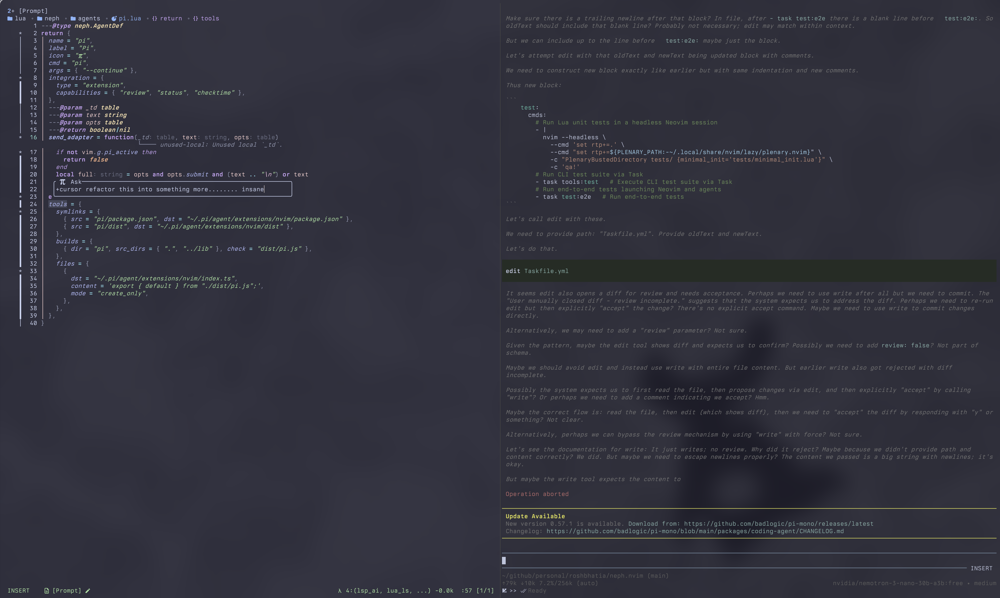
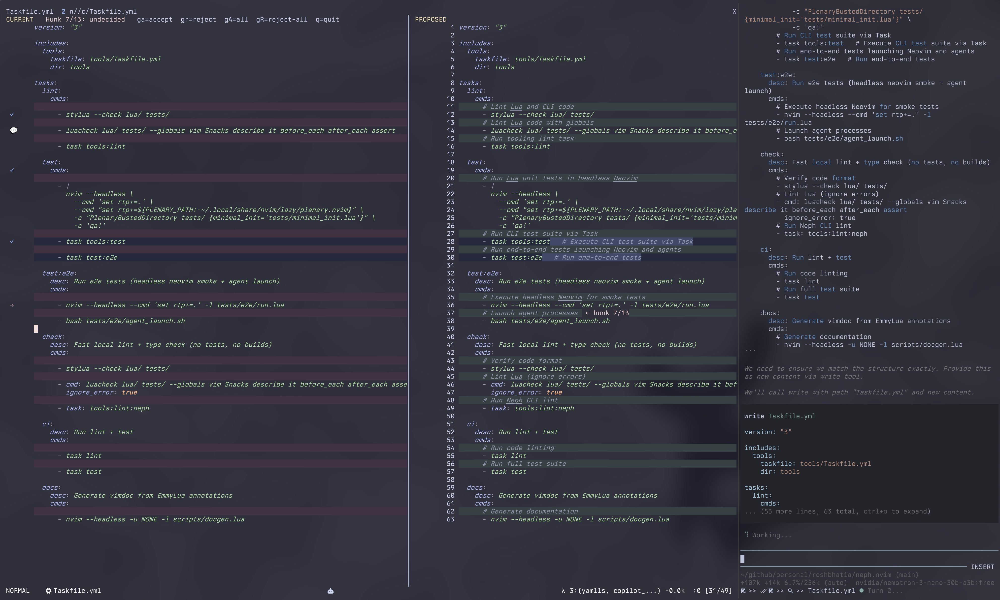

# neph.nvim

WIP Neovim plugin for interactive code review using LLMs.

[](https://github.com/roshbhatia/neph.nvim/actions/workflows/ci.yml)

| Input                                                                 | Review                                                               |
| --------------------------------------------------------------------- | -------------------------------------------------------------------- |
|  |  |

## Lazy plugin spec

```lua
return {
  {
    "roshbhatia/neph.nvim",
    name = "neph.nvim",
    dependencies = {
      "folke/snacks.nvim",
    },
    opts = function()
      return {
        agents = require("neph.agents.all"),
        backend = require("neph.backends.wezterm"), -- or neph.backend.snacks
      }
    end,
    keys = function()
      local api = require("neph.api")
      return {
        -- Session management
        { "<leader>jj", api.toggle, desc = "Neph: toggle / pick agent" },
        { "<leader>jJ", api.kill_and_pick, desc = "Neph: kill session & pick new" },
        { "<leader>jx", api.kill, desc = "Neph: kill active session" },

        -- Prompting (ask/fix/comment all accept visual selections)
        { "<leader>ja", api.ask, mode = { "n", "v" }, desc = "Neph: ask active" },
        { "<leader>jf", api.fix, desc = "Neph: fix diagnostics" },
        { "<leader>jc", api.comment, mode = { "n", "v" }, desc = "Neph: comment" },

        -- History / replay
        { "<leader>jv", api.resend, desc = "Neph: resend previous prompt" },
        { "<leader>jh", api.history, desc = "Neph: browse prompt history" },
      }
    end,
  },
}
```
