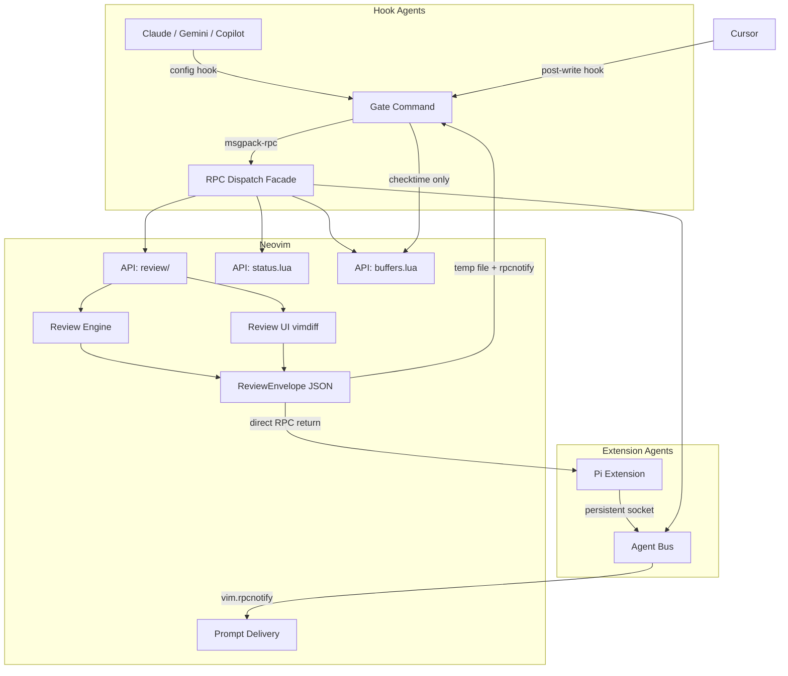

# Project Documentation

## Overview

**neph.nvim** is a Neovim plugin acting as a universal bridge between AI coding agents and Neovim. It enables interactive diff reviews, state management, and tool discovery through a clean RPC interface. The architecture operates via explicit dependency injection and consists of:
- **Lua Plugin (`lua/neph/`)**: Core Neovim integration.
- **Node.js CLI (`tools/neph-cli/`)**: Universal bridge that external agents invoke.
- **Pi Extension (`tools/pi/`)**: Integration for the pi coding agent.

## Architecture

The system acts as an integration and policy layer evaluating deterministic policies and routing agent interactions to Neovim.

## Key Flows

### 1. Hook-based Agents Review Flow (Claude, Gemini, Copilot)
1. The agent executes a tool call (Write/Edit). A configuration hook triggers `neph gate --agent <name>` with the JSON payload on standard input.
2. The gate parses the JSON using declarative schemas and extracts the target `{ filePath, content }`.
3. The gate issues a `review.open` RPC call to Neovim, providing a unique `request_id` and a `result_path` for the output.
4. Neovim launches a vimdiff tab. The user interactively makes per-hunk decisions (`ga` to accept, `gr` to reject).
5. The internal review engine processes the decisions, constructs a `ReviewEnvelope`, writes it to the designated `result_path`, and emits a `neph:review_done` notification.
6. The gate consumes the result file and exits with code `0` (accept) or `2` (reject).

### 2. Extension Agents Review Flow (Pi)
1. The agent invokes `neph.review(filePath, content)` using the persistent `NephClient` SDK.
2. `NephClient` issues the `review.open` RPC request directly to Neovim.
3. Neovim opens a vimdiff tab for user evaluation.
4. The resolved `ReviewEnvelope` is returned directly in the RPC response payload.
5. The agent seamlessly continues execution using the returned envelope's `decision` and `content`.

### 3. Post-write Agents Flow (Cursor)
1. The agent directly writes to a file. A post-write hook invokes `neph gate --agent cursor`.
2. Detecting a `postWriteOnly` schema, the gate simply invokes `buffers.check` (`:checktime`) to refresh Neovim buffers and updates the status line.
3. The gate exits immediately with code `0`.

## API Endpoints

The Neovim integration exposes a customized RPC contract via `protocol.json`.

| Method | Parameters | Async | Description |
|---|---|---|---|
| `review.open` | `request_id`, `result_path`, `channel_id`, `path`, `content` | Yes | Opens an interactive vimdiff review session. |
| `status.set` | `name`, `value` | No | Sets a `vim.g` global variable in Neovim. |
| `status.get` | `name` | No | Retrieves a `vim.g` global variable. |
| `status.unset` | `name` | No | Removes a `vim.g` global variable. |
| `buffers.check` | (none) | No | Triggers `:checktime` in Neovim to reload externally changed files. |
| `tab.close` | (none) | No | Closes the currently active Neovim tab. |

*Note: Extension agents additionally utilize the internal `bus.register` method to register their msgpack-rpc channels.*

## Changelog

[2026-03-26 16:15:00]: Initial creation of consolidated project documentation.
