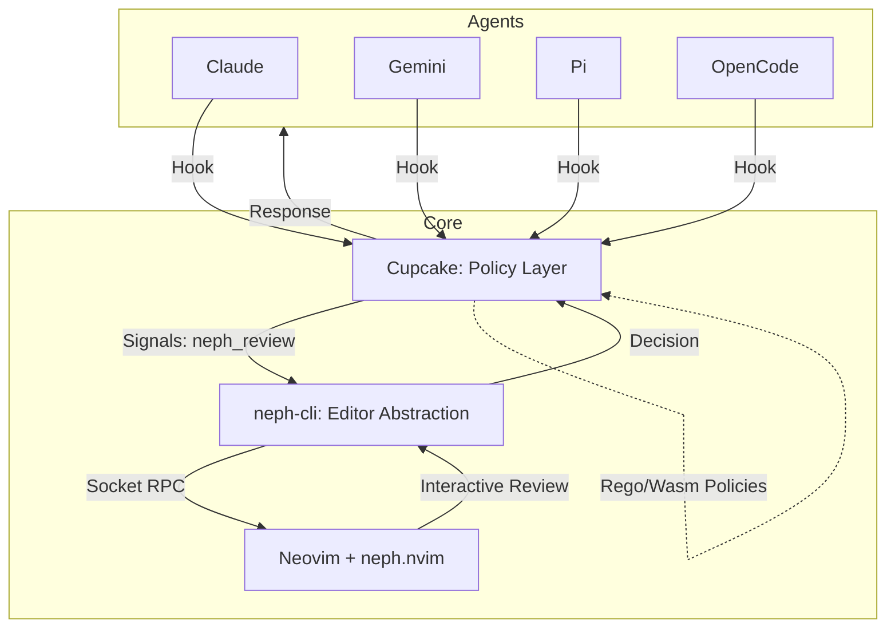
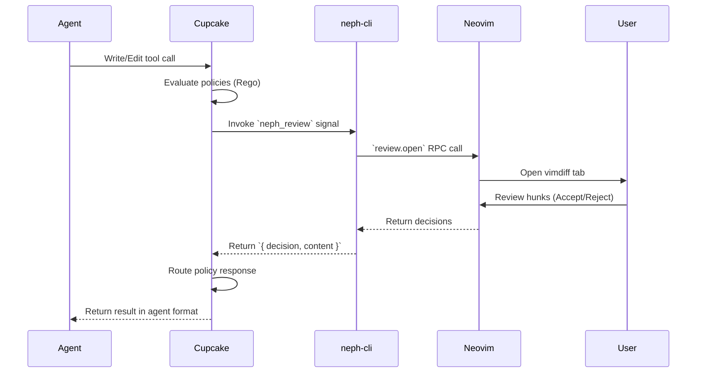

# Neph.nvim Documentation

## Overview
Neph.nvim is a Neovim integration layer for AI agents. It provides interactive code review, terminal management, and status bridging between agents and Neovim. The project uses a composable Dependency Injection (DI) architecture, allowing standalone submodules (agents and backends) to be passed into the setup function via constructor injection.

## Architecture
**Cupcake is the sole integration and policy layer.** No agent ever communicates directly with Neovim. All agent hooks point to `cupcake eval`, which evaluates deterministic policies and invokes `neph-cli` as a signal for interactive review.

### Component Boundaries
1. **Cupcake**: Evaluates deterministic policies (e.g., blocking dangerous commands, protecting sensitive paths) and invokes the `neph_review` signal for write/edit tools.
2. **neph-cli**: A Node.js CLI bridging Cupcake signals to Neovim over a predefined RPC protocol. It possesses no agent awareness.
3. **RPC Dispatch Facade (`lua/neph/rpc.lua`)**: Single Lua module routing incoming RPC from the CLI to internal API modules.
4. **Review Engine vs. UI**: The logic for hunk computation is separated from the vimdiff UI.

## Key Flows

### Interactive Review Flow

## API Endpoints (RPC Protocol)
The protocol uses `neph-rpc/v1`.

| Method | Params | Async | Description |
|--------|--------|-------|-------------|
| `review.open` | `request_id`, `result_path`, `channel_id`, `path`, `content` | Yes | Opens an interactive vimdiff review. |
| `status.set` | `name`, `value` | No | Sets a `vim.g` global variable. |
| `status.get` | `name` | No | Gets a `vim.g` global variable. |
| `status.unset` | `name` | No | Unsets a `vim.g` global variable. |
| `buffers.check` | (none) | No | Calls `:checktime` in Neovim. |
| `tab.close` | (none) | No | Closes the current tab. |

*Note: `bus.register` is an internal method used by extension agents to register their msgpack-rpc channel.*

## Changelog
- **[2024-03-20 16:14:00]**: Created unified documentation (`docs.md`) based on existing `docs/architecture.md`, `docs/rpc-protocol.md`, and `docs/testing.md`. Added Mermaid architecture and flow diagrams.
