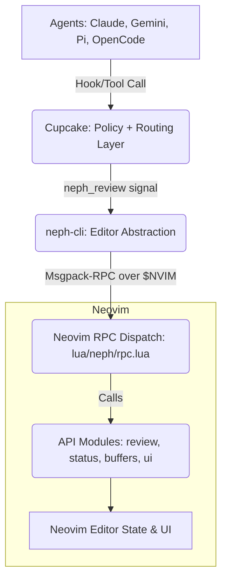
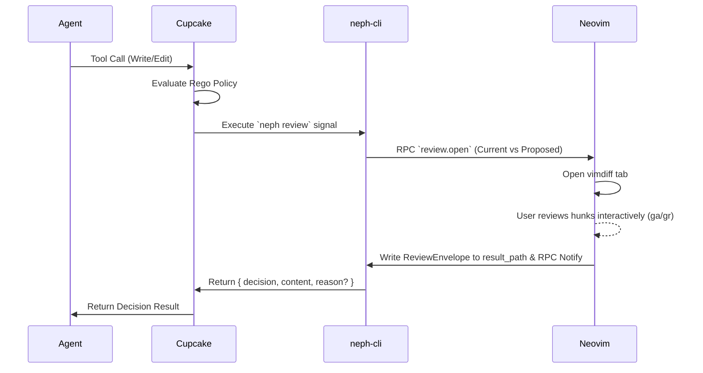

# Project Documentation

## Overview
**neph.nvim** is a Neovim integration layer for AI agents, enabling interactive code review, terminal management, and status bridging. It acts as a universal bridge using explicit dependency injection for agents and backends.

Agents and external tooling never communicate with Neovim directly; instead, **Cupcake** evaluates deterministic policies and invokes `neph-cli` as a signal for interactive reviews and status updates. The CLI converts these signals into structured Neovim RPC commands.

## Architecture

Neph.nvim relies on a composed Dependency Injection (DI) architecture and separates concerns into clear layers:

### Components
1. **Cupcake**: The sole integration policy layer. Evaluates Rego/Wasm deterministic policies to block dangerous operations (e.g., `rm -rf`) and route write/edit tool calls through interactive review.
2. **neph-cli** (`tools/neph-cli/`): Node.js CLI that translates Cupcake signals into standard msgpack-RPC calls for Neovim. It lacks any agent-specific awareness.
3. **RPC Dispatch** (`lua/neph/rpc.lua`): A single routing facade for all incoming Neovim RPCs.
4. **API Modules** (`lua/neph/api/`): Stateless capabilities for review (engine and UI), status (`vim.g`), buffers, and UI dialogs.
5. **Agent Backends & Submodules** (`lua/neph/agents/`, `lua/neph/backends/`): Agents (e.g., `claude`, `goose`, `pi`) and backends (e.g., `snacks`, `wezterm`, `zellij`) are pure data tables and injected via `setup()`.

## Key Flows

### Interactive Code Review

### Agent Extension Registration (Persistent Bus)

For agents with persistent connections (e.g., Pi, OpenCode):
1. Agent starts and connects to `NVIM_SOCKET_PATH`.
2. Agent registers via `bus.register(name, channel)`.
3. Neovim pushes prompts via `vim.rpcnotify(channel, "neph:prompt", text)`.
4. Agent sends reviews and status updates directly via RPC.

## API Endpoints

The system relies heavily on an RPC contract defined in `protocol.json` (`neph-rpc/v1`).

### Core Methods

| Method | Parameters | Async | Description |
|---|---|---|---|
| `review.open` | `request_id`, `result_path`, `channel_id`, `path`, `content` | Yes | Opens an interactive vimdiff session. Final response is a JSON `ReviewEnvelope`. |
| `status.set` | `name`, `value` | No | Sets a global variable (`vim.g`). |
| `status.get` | `name` | No | Retrieves the value of a global variable (`vim.g`). |
| `status.unset` | `name` | No | Unsets a global variable (`vim.g`). |
| `buffers.check` | none | No | Triggers `:checktime` to reload buffers externally modified. |
| `tab.close` | none | No | Closes the current tab. |

### Internal Methods
- `bus.register(name, channel)`: Registers an extension agent to the persistent agent bus.

## Testing & Linting
The project relies on a multi-tiered test suite:
- **Lua Unit Tests** (Headless Neovim via `plenary.busted`) inside `tests/`.
- **Node.js/TypeScript Unit & E2E Tests** (`vitest`) for the CLI, shared library, and Pi extension.
- **Contract Tests**: Both Lua and TS sides validate definitions against `protocol.json`.
- **CI**: Runs in a deterministic Nix environment via Dagger (`task ci`).

## Changelog
- **[2026-03-08]**: Initial generation of unified concise documentation.
