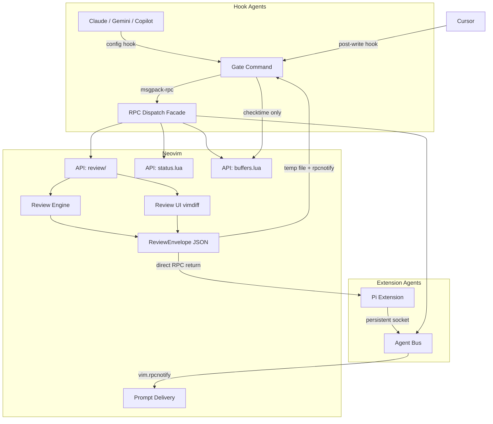

# Project Documentation

## Overview
**neph.nvim** is a Neovim plugin bridging AI agents and Neovim. It enables interactive diff reviews, state management, and tool discovery through a clean RPC interface. It acts as a universal bridge for both hook-based agents (e.g., Claude, Copilot, Gemini) and extension agents with persistent connections (e.g., Pi). The project is composed of a core Lua plugin, a Node.js CLI bridge, and a persistent agent extension layer.

## Architecture

## Key Flows

### Interactive Review Flow (Hook-based Agents)
1. Agent makes a tool call (Write/Edit). Config hook runs `neph gate --agent <name>` with JSON on stdin.
2. Gate parses JSON using declarative schemas to extract file path and content.
3. Gate calls `review.open` via RPC with a unique request ID and result path.
4. Neovim opens a vimdiff tab for interactive per-hunk review.
5. Review engine builds a `ReviewEnvelope`, writes it to the result path, and fires a notification.
6. Gate reads the result and exits, returning control to the agent.

### Interactive Review Flow (Extension Agents)
1. Agent calls `neph.review(filePath, content)` via persistent NephClient.
2. NephClient invokes `review.open` RPC directly.
3. Neovim opens vimdiff tab for review.
4. `ReviewEnvelope` is returned directly via RPC response to the agent.

### Post-write Review Flow (Cursor)
1. Cursor writes a file and triggers a post-write hook to `neph gate`.
2. Gate calls `buffers.check` to update the buffer in Neovim.
3. Gate exits immediately with code 0.

## API Endpoints

The core RPC communication protocol defined in `protocol.json` (`neph-rpc/v1`):

| Method | Params | Async? | Description |
|--------|--------|--------|-------------|
| `review.open` | `request_id`, `result_path`, `channel_id`, `path`, `content` | Yes | Opens an interactive vimdiff review. |
| `status.set` | `name`, `value` | No | Sets a `vim.g` global variable. |
| `status.get` | `name` | No | Gets a `vim.g` global variable. |
| `status.unset` | `name` | No | Unsets a `vim.g` global variable. |
| `buffers.check` | (none) | No | Calls `:checktime` in Neovim. |
| `tab.close` | (none) | No | Closes the current tab. |

*Internal Methods:*
- `bus.register`: Registers an extension agent's msgpack-rpc channel with the bus.

## Changelog
- **[2026-03-09 23:45:38 -0700]**: Initial documentation generated.