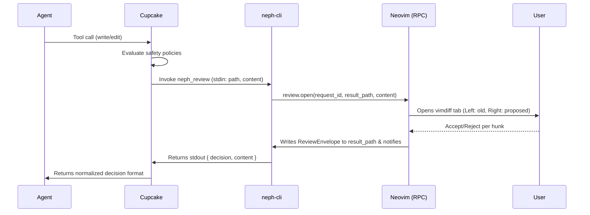

# Neph Documentation

## Overview

**Neph** (`neph.nvim`) is a universal bridge plugin for Neovim that integrates AI coding agents. It explicitly injects agents and terminal multiplexer backends (like snacks.nvim or WezTerm) using dependency injection. Neph enables interactive code review, precise state management, and clear tool discovery via a clean RPC interface.

### Key Components

*   **Lua Plugin** (`lua/neph/`): Core Neovim integration handling UI, state, and DI wiring.
*   **Node.js CLI** (`tools/neph-cli/`): The universal bridge executable (`neph` or `neph-cli`) that external agents call. It abstracts Neovim from the agents.
*   **Cupcake**: The sole integration policy layer that evaluates deterministic policies (Rego/Wasm) for safety before invoking CLI signals.
*   **Pi Extension** (`tools/pi/`): Example of an agent communicating via persistent RPC.
*   **RPC Protocol** (`protocol.json`): The contract defining JSON-RPC methods between CLI tools and the Neovim Lua host.

## Architecture

Neph uses a composable architecture where agents do not talk directly to Neovim.

*   **Agents:** AI tools (e.g., Claude, Gemini, Pi).
*   **Cupcake:** Evaluates rules (e.g., blocking `rm -rf`, protecting `.env` files). Invokes `neph-cli` for write/edit tool usage.
*   **neph-cli:** Connects via the `$NVIM` socket (or searches for a fallback socket) and makes an RPC call to Neovim.
*   **Neovim:** Handles RPC calls through a single dispatch facade (`lua/neph/rpc.lua`), managing vimdiff review UI or updating internal state (`vim.g`).

## Key Flows

### Interactive Diff Review

When an agent requests an edit, Cupcake routes it to `neph-cli review`, triggering Neovim's interactive diff mode.

## API Endpoints (RPC Methods)

Based on the `protocol.json` (`neph-rpc/v1`), these are the core JSON-RPC methods:

| Method | Parameters | Async | Description |
| :--- | :--- | :--- | :--- |
| `review.open` | `request_id`, `result_path`, `channel_id`, `path`, `content` | Yes | Opens an interactive vimdiff review session. |
| `status.set` | `name`, `value` | No | Sets a `vim.g` global variable. |
| `status.get` | `name` | No | Retrieves a `vim.g` global variable. |
| `status.unset` | `name` | No | Removes a `vim.g` global variable. |
| `buffers.check` | *(none)* | No | Calls `:checktime` in Neovim to reload external file changes. |
| `tab.close` | *(none)* | No | Closes the current active tab. |

*Note: `bus.register(name, channel)` is used internally by extension agents for persistent connections but is not exposed in `protocol.json` for CLI tools.*

## Changelog

*   [2026-03-23 16:11:51]: Initial documentation generation consolidating Overview, Architecture, Key Flows, and API endpoints.