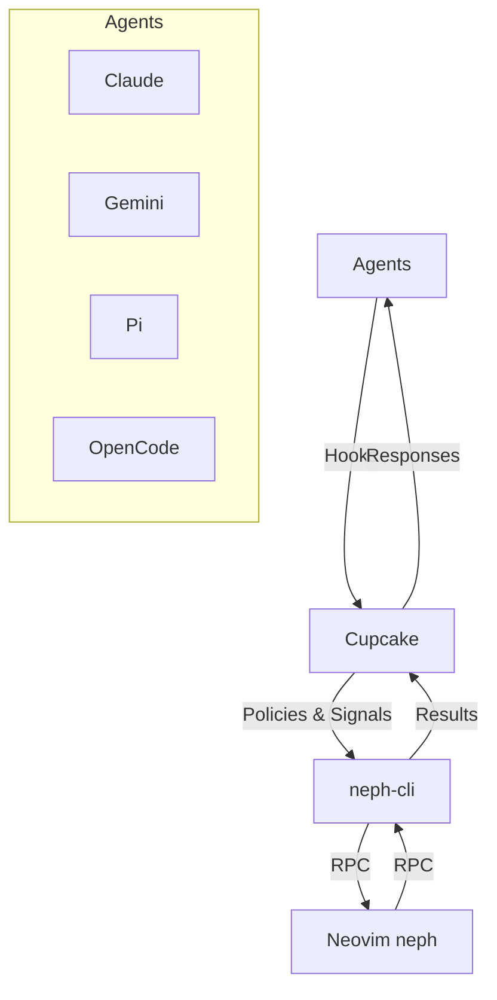
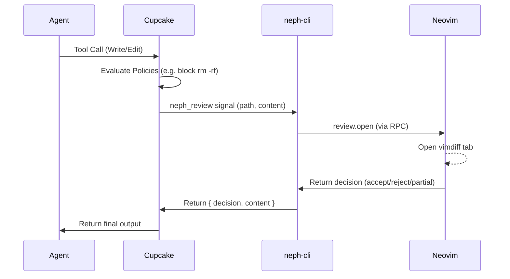

# Project Documentation

## Overview
Neph.nvim is a Neovim integration layer for AI agents. It provides interactive code review, terminal management, and status bridging between agents and Neovim. The project uses a composable Dependency Injection (DI) architecture, allowing standalone submodules for agents and backends.

## Architecture

Cupcake serves as the sole integration layer, evaluating deterministic policies and routing interactions without letting agents directly access Neovim.

## Key Flows
### Interactive Review Flow

## API Endpoints
The RPC protocol (`neph-rpc/v1`) defines the canonical contract between external processes and Neovim:

| Method | Params | Async? | Description |
|--------|--------|--------|-------------|
| `review.open` | `request_id`, `result_path`, `channel_id`, `path`, `content` | Yes | Opens an interactive vimdiff review. |
| `status.set` | `name`, `value` | No | Sets a `vim.g` global variable. |
| `status.get` | `name` | No | Gets a `vim.g` global variable. |
| `status.unset` | `name` | No | Unsets a `vim.g` global variable. |
| `buffers.check` | (none) | No | Calls `:checktime` in Neovim. |
| `tab.close` | (none) | No | Closes the current tab. |
| `ui.select` | `request_id`, `channel_id`, `title`, `options` | Yes | Prompts user with select menu. |
| `ui.input` | `request_id`, `channel_id`, `title`, `default` | Yes | Prompts user for input. |
| `ui.notify` | `message`, `level` | No | Shows a notification. |

## Changelog
* **[2026-03-26 09:01:09]**: Updated icon for bypass gate indicator (`nf-md-skull`)
* **[2026-03-26]**: Added `:NephReview` command for manual buffer-vs-disk review.
* **[2026-03-26]**: Added agent integrations for claude, copilot, cursor, gemini, amp, opencode.
* **[2026-03-26]**: Implemented multi-protocol-architecture with neph CLI.
* **[2026-03-26]**: Added review queue, fs watcher, and post-write review mode.
* **[2026-03-26]**: Introduced composable DI architecture.
