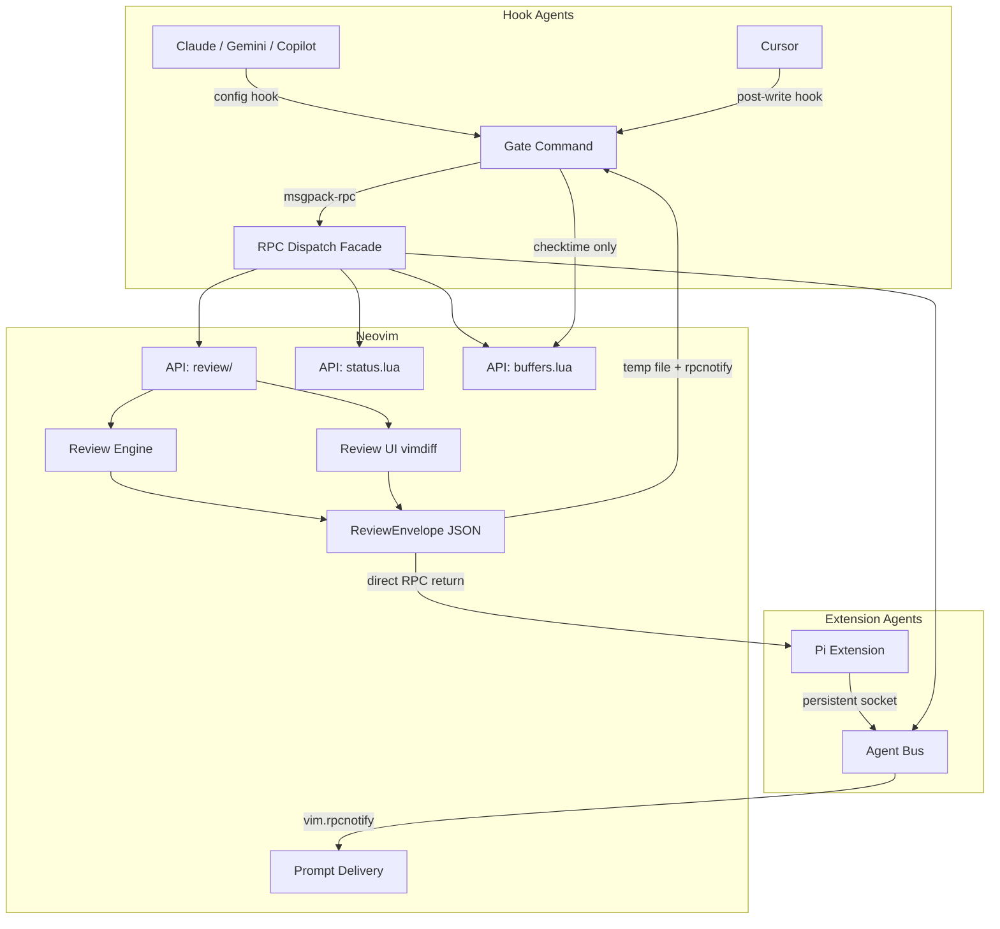

# Project Documentation

## Overview

**neph.nvim** is a Neovim plugin that acts as a universal bridge between AI coding agents and Neovim. It allows for interactive diff reviews, state management, and tool discovery through a clean RPC interface. Instead of hardcoding a list of supported agents or using string-enum configurations, agents and backend modules are injected explicitly via the `setup()` function.

The system is designed with a composable Dependency Injection (DI) architecture, and tests ensure the core Lua logic, Node CLI components, and RPC protocols are robust and match canonical definitions.

### Key Components

1. **Lua Plugin (`lua/neph/`)**: Core Neovim integration, setup logic, RPC dispatch facade, UI rendering, and internal state.
2. **Node.js CLI (`tools/neph-cli/`)**: A bridge routing external hooks from agents (like Claude, Gemini, Copilot, Cursor) into Neovim RPC. Includes a gate system for structured data interception.
3. **Agent Extensions SDK (`tools/lib/`)**: Shared TypeScript library allowing persistent msgpack-rpc connections with auto-reconnect logic.
4. **Pi Extension (`tools/pi/`)**: An extension implementing persistent connection to Neovim for real-time interaction.
5. **RPC Protocol (`protocol.json`)**: The strict contract defining the API methods between external processes and Neovim.

## Architecture

Neph uses a multi-tier approach to connect standalone tools with the editor. The RPC protocol ensures strict typing and structured responses.

## Key Flows

### Interactive Diff Review (Hook-based Agents)

1. **Tool Invocation**: An agent (e.g., Claude) calls a Write/Edit tool. A configured file hook intercepts this and runs `neph gate --agent <name>` with the payload.
2. **Schema Extraction**: The CLI parses the JSON using the specified agent declarative schema to extract the file path and proposed content.
3. **RPC Request**: The CLI issues a `review.open` RPC call to Neovim, providing a UUID `request_id` and a `result_path` for output.
4. **User Review**: Neovim opens a vimdiff split (current vs proposed). The user makes per-hunk decisions (`ga` to accept, `gr` to reject).
5. **Completion**: Neovim generates a JSON `ReviewEnvelope`, writes it to the specified temporary `result_path`, and emits a `neph:review_done` notification.
6. **Agent Feedback**: The Gate reads the result, outputs accept/reject signals via exit code, and the agent continues.

### Extension Agent Messaging (Pi)

1. **Persistent Connection**: The Pi extension registers on the Agent Bus via socket when initialized.
2. **Direct Execution**: When requesting a review, the Pi extension invokes the `review.open` RPC method directly via NephClient instead of using temporary files.
3. **Return**: Neovim returns the `ReviewEnvelope` payload directly in the RPC response.

## API Endpoints

The primary RPC endpoints are defined in `protocol.json` and served over msgpack-rpc via the UNIX socket (`NVIM_SOCKET_PATH`).

| Method | Params | Async | Description |
|--------|--------|-------|-------------|
| `review.open` | `request_id`, `result_path`, `channel_id`, `path`, `content` | Yes | Opens an interactive vimdiff session and blocks until review completion. |
| `status.set` | `name`, `value` | No | Sets a `vim.g` global variable. |
| `status.get` | `name` | No | Reads a `vim.g` global variable. |
| `status.unset` | `name` | No | Unsets a `vim.g` global variable. |
| `buffers.check`| (none) | No | Triggers `:checktime` in Neovim to refresh externally modified files. |
| `tab.close` | (none) | No | Closes the current active tab in Neovim. |

*Internal API Method*
- `bus.register` (params: `name`, `channel`): Registers an extension agent's msgpack-rpc channel ID. Handled explicitly in Lua but omitted from `protocol.json` as it's not called by the standard CLI.

## Changelog

* **[2026-03-24 22:02:26]**: Initial documentation generation consolidating Overview, Architecture, Key Flows, and API endpoints.