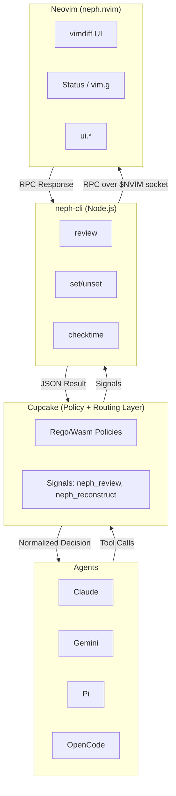
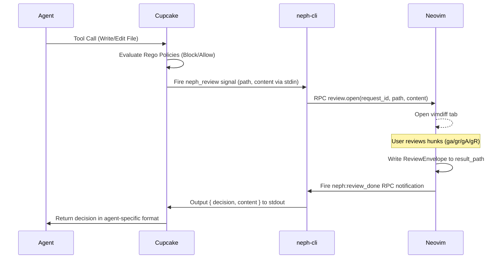

# Neph Documentation

## Overview

**neph.nvim** is a Neovim plugin that provides a universal bridge between AI coding agents and Neovim. It enables interactive hunk-by-hunk diff reviews, state management, and tool discovery through a clean RPC interface. It works by using Cupcake as the sole integration layer, meaning agents never communicate directly with Neovim.

## Architecture

Neph.nvim relies on Cupcake for policy evaluation and routing, and `neph-cli` as the editor abstraction bridging signals to Neovim.

### Component Boundaries

1. **Cupcake:** The sole integration layer. Every agent hook points to `cupcake eval --harness <agent>`. It evaluates deterministic Rego policies (blocks dangerous commands, protects paths) and invokes the `neph_review` signal.
2. **neph-cli:** A Node.js CLI bridging Cupcake signals to Neovim. It speaks a simple protocol (stdin: `{ path, content }`, stdout: `{ decision, content, reason? }`) and has zero agent awareness.
3. **RPC Dispatch Facade (`lua/neph/rpc.lua`):** A single Lua module routing incoming RPC calls to internal API modules.
4. **API Modules (`lua/neph/api/`):** Stateless modules for review, status, buffers, and UI capabilities.
5. **Review Engine vs. UI:** The review system is split into pure logic (headless testable) and the Neovim vimdiff UI layer.

## Key Flows

### Interactive Review Flow

## API Endpoints

The canonical RPC contract is defined in `protocol.json`. The CLI communicates with Neovim via msgpack-rpc over the Unix socket (`$NVIM_SOCKET_PATH` or `$NVIM`).

| Method | Params | Async? | Description |
|--------|--------|--------|-------------|
| `review.open` | `request_id`, `path`, `content`, `[channel_id, result_path, agent, mode]` | Yes | Opens an interactive vimdiff review. |
| `status.set` | `name`, `value` | No | Sets a `vim.g` global variable. |
| `status.get` | `name` | No | Gets a `vim.g` global variable. |
| `status.unset` | `name` | No | Unsets a `vim.g` global variable. |
| `buffers.check` | (none) | No | Calls `:checktime` in Neovim. |
| `tab.close` | (none) | No | Closes the current tab. |
| `ui.select` | `request_id`, `channel_id`, `title`, `options` | Yes | Prompts user to select from options. |
| `ui.input` | `request_id`, `channel_id`, `title`, `default` | Yes | Prompts user for text input. |
| `ui.notify` | `message`, `level` | No | Displays a notification message. |

### Internal Methods

| Method | Params | Description |
|--------|--------|-------------|
| `bus.register` | `name`, `channel` | Registers an extension agent's msgpack-rpc channel with the bus. Not in `protocol.json`. |

## Changelog

- **[2026-03-27]**: Unified documentation into a single Markdown file (`docs.md`). Converted text-based architecture diagrams to Mermaid flowcharts and sequence diagrams. Added missing `ui.select`, `ui.input`, and `ui.notify` API methods from `protocol.json` to the documentation.
