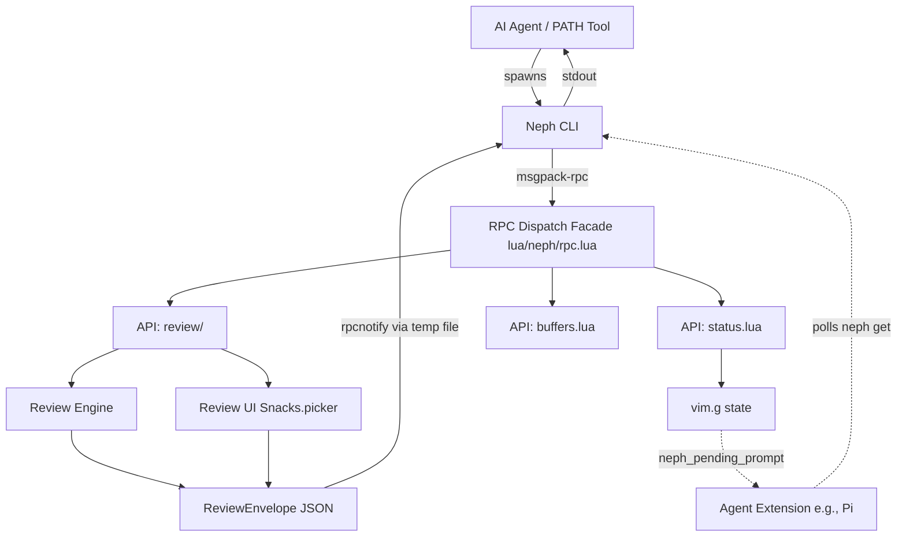

# Project Documentation

## Overview
**neph.nvim** is a Neovim plugin bridging AI agents and Neovim. It enables interactive diff reviews, state management, and tool discovery through a clean RPC interface. It acts as a universal bridge for both hook-based agents (e.g., Claude, Copilot, Gemini) and extension agents with persistent connections (e.g., Pi). The project is composed of a core Lua plugin, a Node.js CLI bridge, and a persistent agent extension layer.

## Architecture

## Key Flows

### Interactive Review
1. **Agent** spawns `neph review <path>` with proposed content on `stdin`.
2. **`neph`** discovers the Neovim socket and calls `review.open` via `rpc.lua`.
3. **`rpc.lua`** dispatches to `neph.api.review.open`.
4. **Neovim** opens a diff tab and starts the interactive `Snacks.picker` loop.
5. **User** makes per-hunk decisions.
6. **Review Engine** builds a `ReviewEnvelope` JSON.
7. **Neovim** writes the result to a temp file and fires an `rpcnotify`.
8. **`neph`** receives the notification, reads the result, prints JSON to `stdout`, and exits.
9. **Agent** parses `stdout` and continues its workflow.

### Post-write Review (Cursor)
1. Cursor writes a file and triggers a post-write hook to `neph gate`.
2. Gate calls `buffers.check` to update the buffer in Neovim.
3. Gate exits immediately with code 0.

## API Endpoints

The core RPC communication protocol defined in `protocol.json` (`neph-rpc/v1`):

| Method | Params | Async? | Description |
|--------|--------|--------|-------------|
| `review.open` | `request_id`, `result_path`, `channel_id`, `path`, `content` | Yes | Opens an interactive vimdiff review. |
| `status.set` | `name`, `value` | No | Sets a `vim.g` global variable. |
| `status.get` | `name` | No | Gets a `vim.g` global variable. |
| `status.unset` | `name` | No | Unsets a `vim.g` global variable. |
| `buffers.check` | (none) | No | Calls `:checktime` in Neovim. |
| `tab.close` | (none) | No | Closes the current tab. |

*Internal Methods:*
- `bus.register`: Registers an extension agent's msgpack-rpc channel with the bus.

## Changelog
- **[2026-03-09 23:45:38 -0700]**: Initial documentation generated.