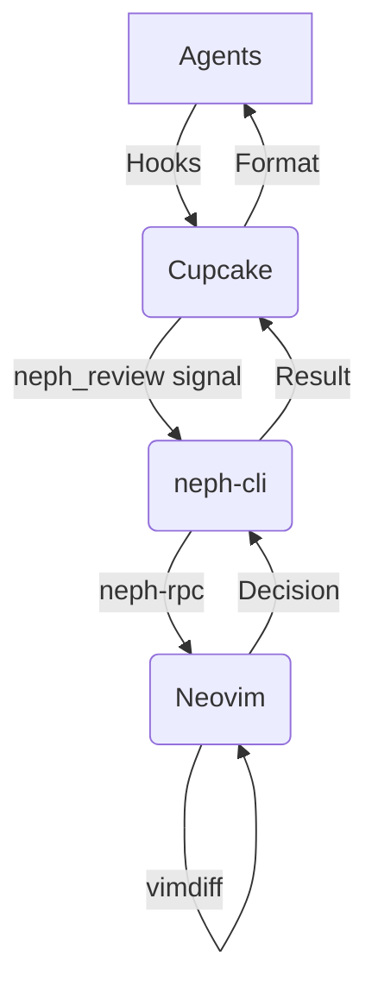
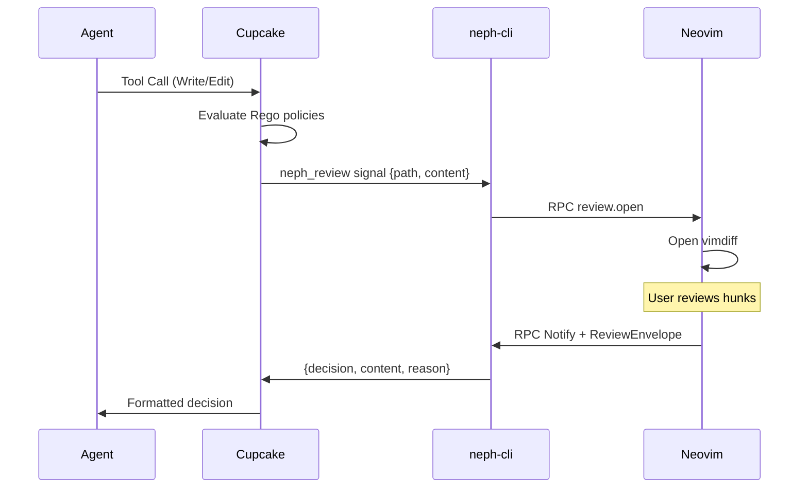

# Project Documentation

## Overview

**neph.nvim** is a Neovim plugin designed as a universal integration layer between AI coding agents and Neovim. It allows for interactive code review, terminal management, and status bridging. Its architecture revolves around an external policy layer called **Cupcake**, which evaluates deterministic policies and invokes `neph-cli` as a signal for interactive hunk-by-hunk review in Neovim, ensuring agents never communicate directly with Neovim.

## Architecture

Neph uses a composable Dependency Injection (DI) architecture. Agents and backends are passed into the setup explicitly.

- **Cupcake (Policy Layer):** Evaluates deterministic Rego/Wasm policies and triggers interactive reviews via the `neph_review` signal.
- **neph-cli (Editor Abstraction):** A Node.js CLI that bridges Cupcake signals to Neovim over the custom `neph-rpc` protocol using the `$NVIM` Unix socket.
- **Lua Plugin:** Contains the Neovim integration, managing review engines, UIs, buffers, and statuses.

## Key Flows

### Interactive Review Flow

1. An agent attempts a file write/edit tool call.
2. The agent's hook triggers `cupcake eval --harness <agent>`.
3. Cupcake evaluates policies (blocking dangerous commands or paths).
4. The `neph_review` signal fires, utilizing `neph_reconstruct` to normalize JSON into `{ path, content }`.
5. The `neph_review` signal pipes the payload to `neph-cli review`.
6. `neph-cli` connects to the Neovim socket and triggers `review.open`.
7. Neovim opens a vimdiff tab allowing the user to accept or reject hunks interactively.
8. Upon completion, a JSON `ReviewEnvelope` is written to a temporary file and `neph-cli` is notified via RPC.
9. `neph-cli` returns the decision to Cupcake, which then relays it to the agent.

## API Endpoints (RPC Protocol)

The RPC contract uses `neph-rpc/v1` over the Neovim msgpack-rpc Unix socket.

| Method          | Async? | Description |
|-----------------|--------|-------------|
| `review.open`   | Yes    | Opens an interactive vimdiff review. Accepts `request_id`, `result_path`, `channel_id`, `path`, and `content`. |
| `status.set`    | No     | Sets a `vim.g` global variable. |
| `status.get`    | No     | Gets a `vim.g` global variable. |
| `status.unset`  | No     | Unsets a `vim.g` global variable. |
| `buffers.check` | No     | Calls `:checktime` in Neovim to reload externally modified buffers. |
| `tab.close`     | No     | Closes the current tab. |

Internal Methods:
- `bus.register`: Registers an extension agent's msgpack-rpc channel.

## Changelog

**1.0.0 (2026-03-26)**

- Replaced gate/bus/NephClient with Cupcake as the sole integration layer.
- Implemented multi-protocol-architecture with `neph` CLI.
- Migrated open agents (e.g., OpenCode, Amp, Pi) to native Cupcake UI bridging.
- Extensively overhauled review UI with line numbers, custom signs, and robust cleanup.
- Refactored project into composable DI architecture for agents and backends.
- Replaced hardcoded gate parsers with declarative agent schemas in Cupcake.
- Added e2e test suite for agent integrations and fuzz tests.

---

*[Version Note: Generated 2026-03-31T16:28:31Z]*
