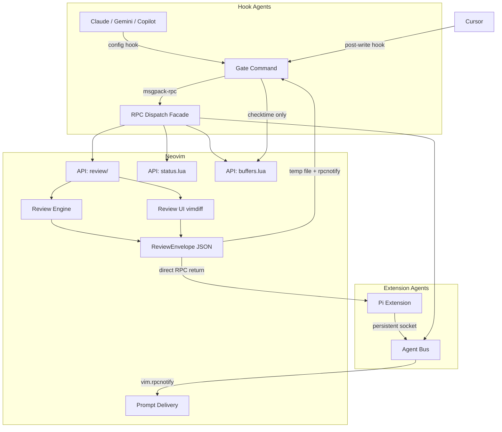

# Project Documentation

## Overview
`neph.nvim` is a Neovim plugin designed for interactive code review using LLMs. It provides a universal bridge between external agentic processes (such as Claude, Gemini, Copilot, or Cursor) and Neovim, enabling interactive reviews, state management, and tool discovery.

## Architecture

## Key Flows

### Interactive Review: Hook-based Agents
1. **Tool Call**: Agent makes a tool call. The config hook runs `neph gate --agent <name>` with JSON on `stdin`.
2. **Extraction**: The Gate parses the JSON using the agent's declarative schema and extracts `{ filePath, content }`.
3. **Open Review**: Gate calls `review.open` via RPC with a unique `request_id` and `result_path`.
4. **Vimdiff Review**: Neovim opens a vimdiff tab where the user makes per-hunk accept/reject decisions.
5. **Envelope Build**: The review engine builds a `ReviewEnvelope`, writes to `result_path`, and fires a `neph:review_done` notification.
6. **Result Handling**: Gate reads the result, exiting with code `0` (accept) or `2` (reject).

### Interactive Review: Extension Agents
1. **Invocation**: Agent calls `neph.review(filePath, content)` via `NephClient`.
2. **Direct RPC**: `NephClient` invokes the `review.open` RPC directly.
3. **Vimdiff Review**: Neovim opens a vimdiff tab for user review.
4. **Direct Envelope Return**: `ReviewEnvelope` is returned directly via RPC response.
5. **Agent Continuation**: The agent uses the envelope's `decision` and `content` fields.

### Post-write Agents
1. **Write Event**: Agent writes to a file. A post-write hook runs `neph gate --agent <name>`.
2. **Status Update**: Gate detects the `postWriteOnly` schema, calls `buffers.check`, and sets the statusline state.
3. **Exit**: Gate exits immediately with code `0` as no review is needed.

## API Endpoints

The system uses a custom `neph-rpc/v1` protocol over standard `msgpack-rpc` on Unix sockets.

| Method | Params | Async? | Description |
|--------|--------|--------|-------------|
| `review.open` | `request_id`, `result_path`, `channel_id`, `path`, `content` | Yes | Opens an interactive vimdiff review. |
| `status.set` | `name`, `value` | No | Sets a `vim.g` global variable. |
| `status.get` | `name` | No | Gets a `vim.g` global variable. |
| `status.unset` | `name` | No | Unsets a `vim.g` global variable. |
| `buffers.check` | (none) | No | Calls `:checktime` in Neovim. |
| `tab.close` | (none) | No | Closes the current tab. |
| `bus.register` | `name`, `channel` | No | Registers an extension agent's `msgpack-rpc` channel with the bus. *(Internal)* |

## Changelog
- **[2026-03-14]**: Initialized `docs.md` consolidating project documentation.
