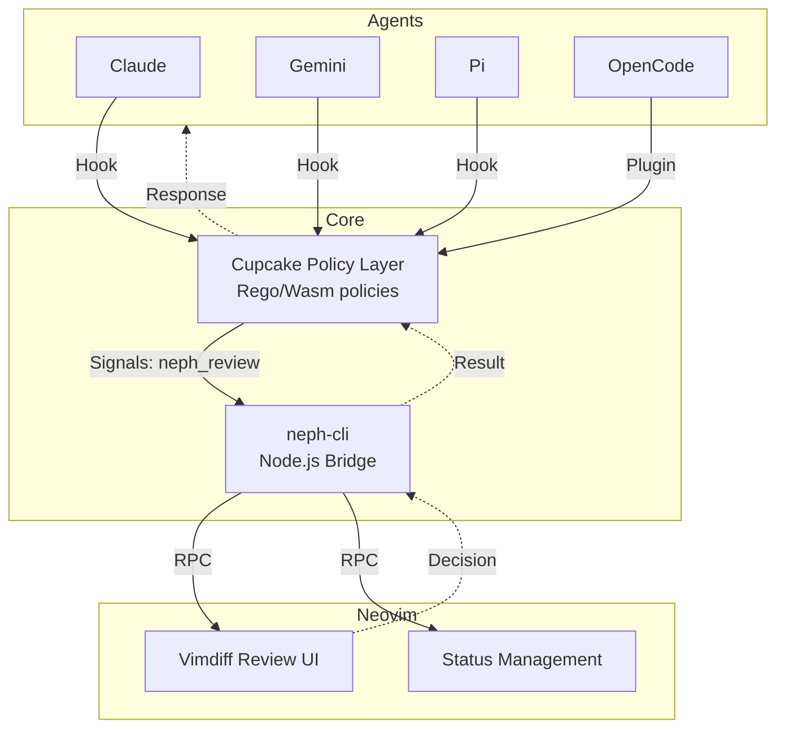
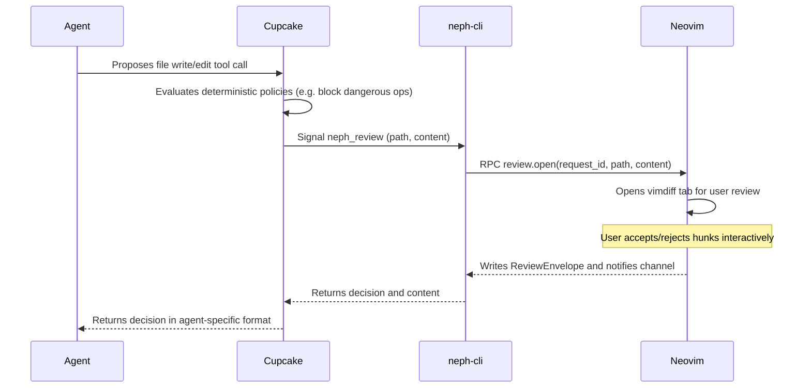

# Project Documentation

## Overview
**neph.nvim** is a Neovim integration layer for AI agents. It provides a universal bridge between AI coding agents and Neovim, enabling interactive diff reviews, state management, and tool discovery through a clean RPC interface. It ensures agents never communicate directly with Neovim, but instead go through a policy evaluation layer (Cupcake) which then invokes `neph-cli` for interactive review.

## Architecture
The project uses a composable Dependency Injection (DI) architecture. Agents and backends are standalone submodules passed into `setup()` via constructor injection.

## Key Flows

### Interactive Review Flow

## API Endpoints
The Neph RPC protocol (`neph-rpc/v1`) defines the contract between external processes and Neovim.

| Method | Params | Async | Description |
|--------|--------|-------|-------------|
| `review.open` | `request_id`, `path`, `content` | Yes | Opens an interactive vimdiff review. |
| `status.set` | `name`, `value` | No | Sets a `vim.g` global variable. |
| `status.get` | `name` | No | Gets a `vim.g` global variable. |
| `status.unset` | `name` | No | Unsets a `vim.g` global variable. |
| `buffers.check` | (none) | No | Calls `:checktime` in Neovim. |
| `tab.close` | (none) | No | Closes the current tab. |
| `ui.select` | `request_id`, `channel_id`, `title`, `options` | Yes | Opens a selection UI. |
| `ui.input` | `request_id`, `channel_id`, `title`, `default` | Yes | Opens an input UI. |
| `ui.notify` | `message`, `level` | No | Displays a notification. |

## Changelog
* **2026-03-26 (v1.0.0):**
  * Add `:NephReview` command for manual buffer-vs-disk review.
  * Add agent integrations for claude, copilot, cursor, gemini, amp, opencode.
  * Implement multi-protocol architecture with neph CLI.
  * Replace gate/bus/NephClient with Cupcake as sole integration layer.
  * Overhaul review diff UI with dual signs, walkback, and explicit submit.
  * Implement composable DI architecture for agents and backends.

*Last Updated: 2026-03-26*
