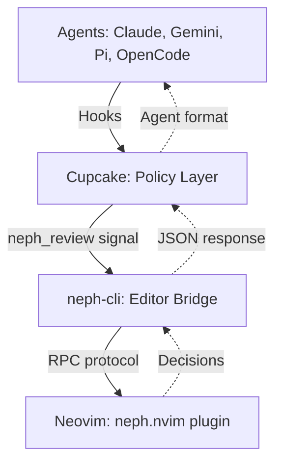
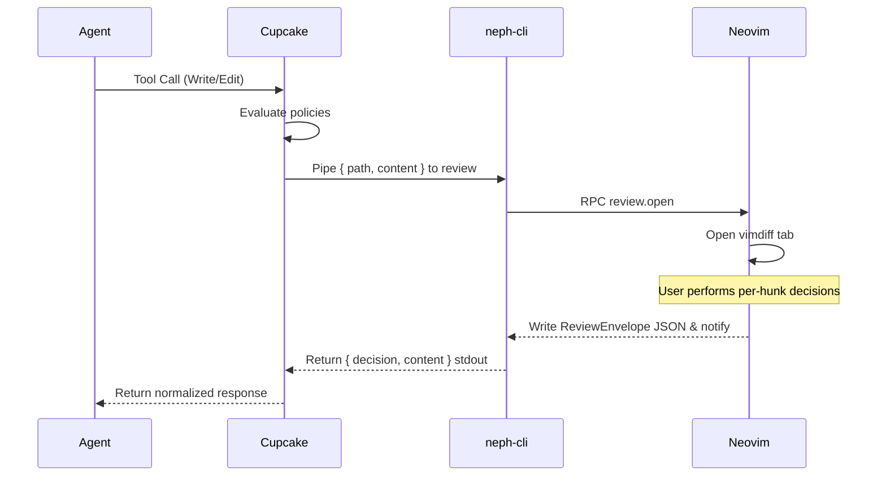

# Project Documentation

## Overview
Neph.nvim is a Neovim plugin designed for interactive code review using LLMs. It functions as a universal bridge connecting AI coding agents with Neovim, using a clean RPC interface. It enables interactive diff reviews, terminal management, state management, and tool discovery. Agents and backends are injected explicitly via a composable Dependency Injection (DI) architecture, without hardcoded lists.

Cupcake is the sole integration layer. Agents interact exclusively with Cupcake, which evaluates deterministic policies and then invokes the `neph-cli` as a signal for interactive review. This architecture completely prevents agents from communicating directly with Neovim.

## Architecture
The system is composed of several key components:
* **Cupcake (Policy & Routing):** Evaluates Rego/Wasm policies to block dangerous commands and invokes the `neph_review` signal.
* **neph-cli (Editor Abstraction):** A Node.js CLI (`tools/neph-cli/`) that bridges signals to Neovim via an RPC protocol. It operates without agent-specific logic.
* **RPC Dispatch Facade:** Routes incoming RPC to API modules within `lua/neph/rpc.lua`.
* **API Modules:** Stateless implementations of capabilities like `review/`, `status.lua`, `buffers.lua`, and `ui.lua`.
* **Review Engine vs. UI:** Diff computation is handled by the pure logic Engine (`lua/neph/api/review/engine.lua`), while the UI manages the vimdiff tab (`lua/neph/api/review/ui.lua`).

## Key Flows
The interactive review process involves an async request-correlated protocol between an agent and Neovim.

### Interactive Code Review

## API Endpoints
The RPC interface between external processes and Neovim is strictly defined in `protocol.json` (`neph-rpc/v1`).

| Method | Params | Async | Description |
|---|---|---|---|
| `review.open` | `request_id`, `result_path`, `channel_id`, `path`, `content` | Yes | Opens an interactive vimdiff review. |
| `status.set` | `name`, `value` | No | Sets a `vim.g` global variable. |
| `status.get` | `name` | No | Gets a `vim.g` global variable. |
| `status.unset` | `name` | No | Unsets a `vim.g` global variable. |
| `buffers.check` | (none) | No | Calls `:checktime` in Neovim. |
| `tab.close` | (none) | No | Closes the current tab. |

Internal Methods (Not in `protocol.json`):
* `bus.register` (`name`, `channel`): Registers an extension agent's msgpack-rpc channel. Used via NephClient SDK.

## Changelog
* **[2026-03-17 16:16:00]:** Initial generation of unified project documentation (`docs.md`).
* **[2026-03-16 19:13:35]:** Added headless E2E tests for the `neph-cli` review to Neovim flow.
