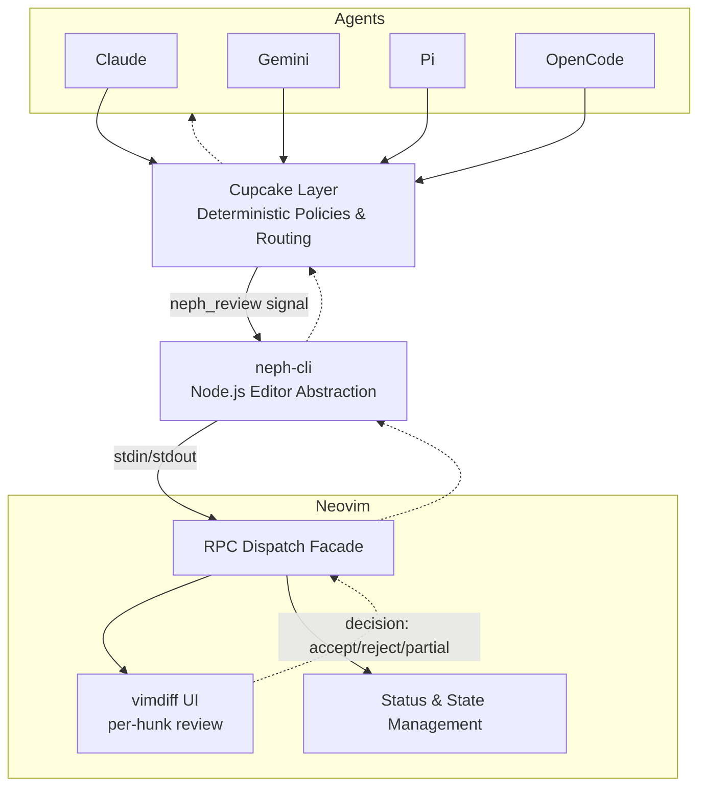
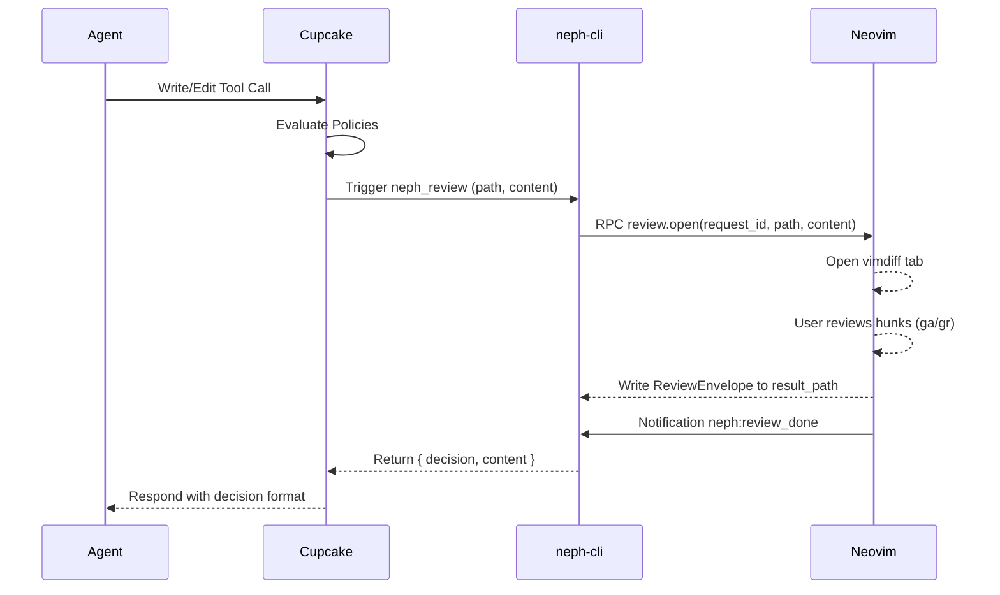

# Project Documentation

## Overview
**neph.nvim** is a Neovim integration layer for AI agents, providing interactive code review, terminal management, and status bridging. It acts as a universal bridge, consolidating agent tool interactions and managing deterministic policies through `Cupcake`. The plugin supports interactive hunk-by-hunk diff reviews and exposes an RPC interface for external tooling (Node.js CLI, extension agents like `pi`, and IDE companion servers).

## Architecture

- **Cupcake**: The sole integration layer evaluating Rego/Wasm policies to block dangerous operations and routing tools via signals.
- **neph-cli**: A Node.js CLI that serves as a generic Neovim bridge, utilizing `$NVIM` Unix sockets for RPC.
- **RPC Dispatch Facade (`lua/neph/rpc.lua`)**: Processes external commands and triggers Neovim native capabilities (buffers, UI, state).

## Key Flows

### Interactive Review Flow

## API Endpoints

The system relies on a Custom RPC Contract (`protocol.json`) via `msgpack-rpc`.

| Method | Parameters | Async | Description |
|---|---|---|---|
| `review.open` | `request_id`, `result_path`, `channel_id`, `path`, `content` | Yes | Opens an interactive vimdiff review and waits for user decision. |
| `status.set` | `name`, `value` | No | Sets a `vim.g` global variable. |
| `status.get` | `name` | No | Gets a `vim.g` global variable. |
| `status.unset` | `name` | No | Unsets a `vim.g` global variable. |
| `buffers.check` | (none) | No | Calls `:checktime` in Neovim to sync disk changes. |
| `tab.close` | (none) | No | Closes the current active tab. |

*Internal Extension API*: `bus.register(name, channel)` registers an extension agent's RPC channel.

## Changelog

- **[2026-03-26] 1.0.0**:
  - Added `:NephReview` command for manual buffer-vs-disk reviews.
  - Replaced hardcoded gate parsers with declarative agent schemas.
  - Added new agent integrations (`claude`, `copilot`, `cursor`, `gemini`, `amp`, `opencode`).
  - Added `status.get` to `protocol.json` contract.
  - Overhauled review diff UI with dual signs, dropbar fixes, and explicit submit.
  - Implemented Cupcake as the sole integration layer.
  - Native UI and persistent bridge for `OpenCode`, `Amp`, and `Pi` agents.
  - Added debug logging across Lua and TypeScript.

---
*Updated: 2026-03-27T09:01:09Z*