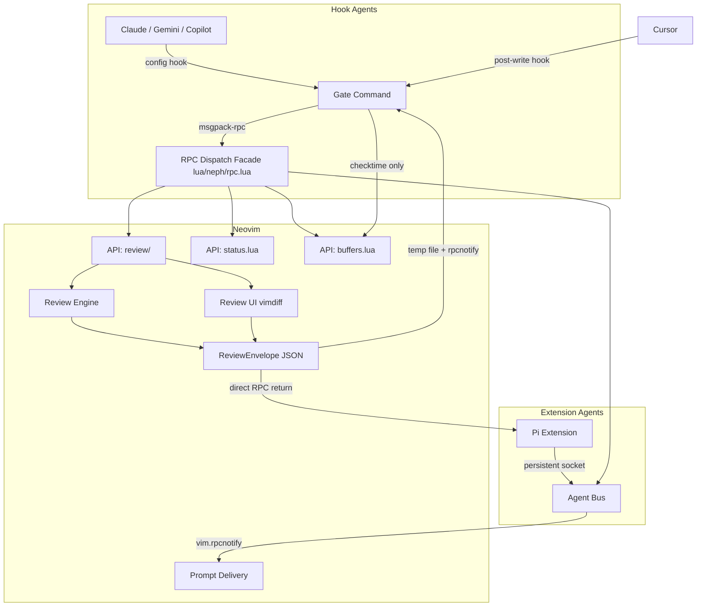

# Project Documentation

## Overview
**neph.nvim** is a Neovim plugin bridging AI agents and Neovim. It enables interactive diff reviews, state management, and tool discovery through a clean RPC interface. It acts as a universal bridge for both hook-based agents (e.g., Claude, Copilot, Gemini) and extension agents with persistent connections (e.g., Pi). The project is composed of a core Lua plugin, a Node.js CLI bridge, and a persistent agent extension layer.

## Architecture

## Key Flows

### Interactive Review
1. **Hook Agent** makes a tool call (Write/Edit). Config hook runs `neph gate --agent <name>` with JSON on stdin.
2. **Gate** parses JSON using the agent's declarative schema and extracts `{ filePath, content }`.
3. **Gate** calls `review.open` via RPC with a unique `request_id` and `result_path`.
4. **Neovim** opens a vimdiff tab. User makes per-hunk accept/reject decisions.
5. **Review Engine** builds a `ReviewEnvelope`, writes to `result_path`, fires `neph:review_done` notification.
6. **Gate** reads the result, exits with code 0 (accept) or 2 (reject).
7. **Agent** continues or retries based on exit code.

### Post-write Review (Cursor)
1. Cursor writes a file and triggers a post-write hook to `neph gate --agent cursor`.
2. Gate detects `postWriteOnly` schema and calls `buffers.check` to update the buffer in Neovim.
3. Gate exits immediately with code 0 (no review needed).

## API Endpoints

The core RPC communication protocol defined in `protocol.json` (`neph-rpc/v1`):

| Method | Params | Async? | Description |
|--------|--------|--------|-------------|
| `review.open` | `request_id`, `result_path`, `channel_id`, `path`, `content` | Yes | Opens an interactive vimdiff review. |
| `status.set` | `name`, `value` | No | Sets a `vim.g` global variable. |
| `status.get` | `name` | No | Gets a `vim.g` global variable. |
| `status.unset` | `name` | No | Unsets a `vim.g` global variable. |
| `buffers.check` | (none) | No | Calls `:checktime` in Neovim. |
| `tab.close` | (none) | No | Closes the current tab. |

*Internal Methods:*
- `bus.register`: Registers an extension agent's msgpack-rpc channel with the bus.

## Changelog
- **[2026-03-13 16:17:08 +0000]**: Updated architecture documentation and diagram to correctly reflect the `Gate` system, persistent bus, and `Cursor` post-write integration. Improved CLI socket discovery logic by falling back to `git rev-parse --show-toplevel` for matching correct Neovim instance when there are multiple candidates.
- **[2026-03-09 23:45:38 -0700]**: Initial documentation generated.