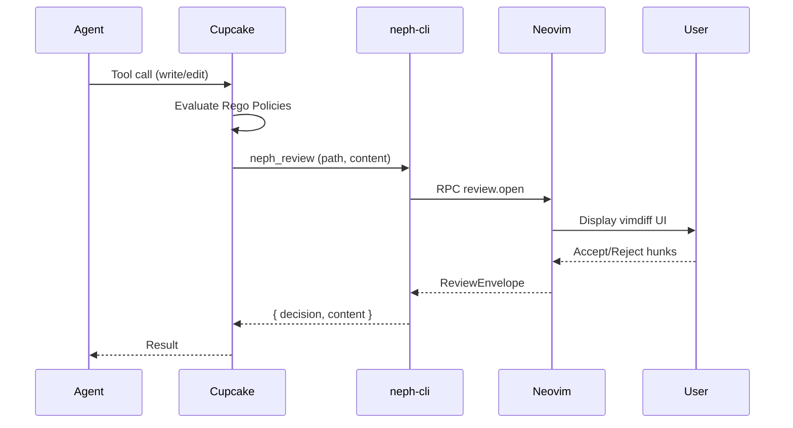

# neph.nvim Documentation

**Version:** 2026-03-08 10:00:00 UTC
**Status:** Updated to reflect the Cupcake-based architecture, extension agents (e.g., pi), and RPC protocol enhancements.

## Overview
**neph.nvim** is a Neovim plugin that provides a universal bridge between AI coding agents and Neovim. It enables interactive diff reviews, state management, and tool discovery through a clean RPC interface.

Key features include:
- Interactive code reviews via Neovim vimdiff.
- Deterministic policy evaluation using Cupcake for safe and controlled agent operations.
- Composable Dependency Injection (DI) architecture for backends and agents.
- Comprehensive tool manifests including reading, editing, and checking dependencies.

## Architecture

Neph.nvim relies on **Cupcake** as the sole integration and policy layer. External agents do not communicate directly with Neovim; instead, they trigger Cupcake eval, which runs deterministic policies (e.g., Rego/Wasm) and routes requests (like write/edit operations) to `neph-cli` as signals.

The architecture comprises:
1. **Cupcake (Policy + Routing):** Evaluates deterministic policies and routes requests.
2. **neph-cli:** A Node.js CLI that bridges Cupcake signals to Neovim.
3. **RPC Dispatch:** Lua-based dispatcher (`lua/neph/rpc.lua`) in Neovim that routes external requests to internal APIs.
4. **API Modules & Review UI:** Stateless logic in `lua/neph/api/` that handles file diffs, vim.g status management, buffer changes, and vimdiff UI.

```mermaid
graph TD
    A[AI Agents (Claude, Gemini, Pi, OpenCode)] -->|Tool Hook| B[Cupcake]
    B -->|Deterministic Policies| C{Policy Decision}
    C -->|Allow/Modify/Deny| D[Agent Response]
    C -->|Write/Edit Tools| E[neph_review signal]
    E --> F[neph_reconstruct]
    F --> G[neph-cli review]
    G -->|RPC over Unix Socket| H[Neovim neph.nvim]
    H -->|Vimdiff Interactive Review| I[User Decision]
    I --> G
    G --> E
    E --> C
```

## Key Flows

### Interactive Code Review
1. An agent proposes a file change. Its hook fires `cupcake eval --harness <agent>`.
2. Cupcake evaluates policies (blocking dangerous commands, protecting sensitive paths).
3. If allowed, the `neph_review` signal normalizes the tool JSON to `{ path, content }`.
4. `neph-cli` sends this payload to Neovim via RPC (`review.open`).
5. Neovim opens a vimdiff tab. The user interactively accepts/rejects hunks.
6. Neovim writes the decision envelope and notifies `neph-cli`.
7. `neph-cli` passes the decision back to Cupcake, which sends it to the agent.



## API Endpoints

The communication between the external CLI (and by extension Cupcake) and Neovim happens via msgpack-rpc (`protocol.json`).

### Core Methods

| Method | Parameters | Async | Description |
|---|---|---|---|
| `review.open` | `request_id`, `result_path`, `channel_id`, `path`, `content` | Yes | Opens an interactive vimdiff review and writes the user's decision to `result_path`. |
| `status.set` | `name`, `value` | No | Sets a `vim.g` global variable. |
| `status.get` | `name` | No | Gets a `vim.g` global variable. |
| `status.unset` | `name` | No | Unsets a `vim.g` global variable. |
| `buffers.check` | None | No | Calls `:checktime` in Neovim to reload externally modified buffers. |
| `tab.close` | None | No | Closes the current tab. |

### Internal Methods
- `bus.register` (`name`, `channel`): Registers an extension agent's msgpack-rpc channel with the internal bus for persistent communication (e.g., used by the Pi extension).

## Changelog

- **[2026-03-08 10:00:00 UTC]**: Initial documentation generated for the new Cupcake-based architecture, consolidating `docs/architecture.md`, `tools/README.md`, `README.md`, and `docs/rpc-protocol.md`. Outlines the updated dependencies, the node extension `pi-nvim-extension`, and the unified Cupcake policy routing.
