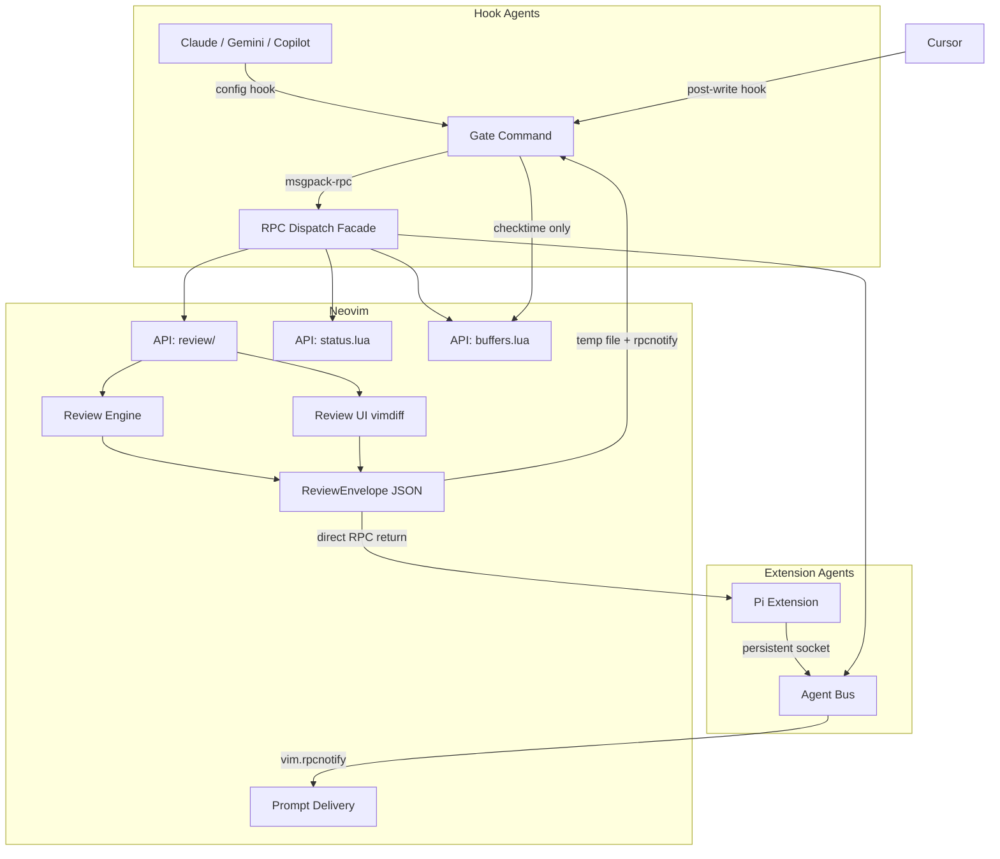

# Neph Architecture

Neph.nvim is a Neovim integration layer for AI agents. It provides a universal bridge between external agentic processes and Neovim, enabling interactive reviews, state management, and tool discovery.

## Component Boundaries

### 1. Neovim Bridge CLI (`neph`)
A Node.js/TypeScript CLI (`tools/neph-cli/`) that serves as the entry point for hook-based agents:
- **Gate command**: Intercepts agent tool calls (write/edit) via config file hooks, runs interactive review in Neovim, returns accept/reject exit code.
- **Review command**: Direct interactive diff review (`neph review <path>` with content on stdin).
- **Status commands**: `set`, `unset`, `get`, `checktime`, `close-tab` — one-off RPC calls.

### 2. Extension Agent SDK (`tools/lib/`)
A shared TypeScript library (`NephClient`) for extension agents that maintain persistent socket connections to Neovim:
- **NephClient** (`neph-client.ts`): Persistent msgpack-rpc connection with auto-reconnect (exponential backoff, 100ms → 5s cap).
- **Debug logging** (`log.ts`): Shared logger writing to `/tmp/neph-debug.log` when `NEPH_DEBUG=1`.

### 3. RPC Dispatch Facade (`lua/neph/rpc.lua`)
A single Lua module that routes all incoming RPC requests to internal API modules. It handles:
- Method routing
- Error normalization
- Pcall-wrapped execution

### 4. API Modules (`lua/neph/api/`)
Stateless modules implementing specific capabilities:
- `review/`: Core diff review logic and UI.
- `status.lua`: Global state management (`vim.g`).
- `buffers.lua`: Buffer and tab operations.

### 5. Review Engine vs. UI
The review system is split into two layers:
- **Engine** (`lua/neph/api/review/engine.lua`): Pure logic for hunk computation and decision application. Testable in headless Neovim.
- **UI** (`lua/neph/api/review/ui.lua`): Vimdiff tab with per-hunk accept/reject keymaps, signs, winbar, and virtual text hints.

### 6. Agent Bus (`lua/neph/internal/bus.lua`)
Persistent channel registry for extension agents (type `"extension"`):
- Agents register with their msgpack-rpc channel ID on connect.
- Prompts are pushed via `vim.rpcnotify(channel, "neph:prompt", text)` — no polling.
- A 1-second health timer detects dead channels via `pcall(vim.rpcnotify, ch, "neph:ping")` and auto-unregisters them.

### 7. Gate System (`tools/neph-cli/src/gate.ts`)
Declarative agent schemas for intercepting file mutations from hook-based agents:
- Each agent has an `AgentSchema` defining tool names, field mappings, and optional preprocessing.
- `parseWithSchema()` generically extracts `{ filePath, content }` from any agent's JSON.
- Supported agents: Claude, Copilot, Gemini, Cursor.
- Cursor is post-write-only (just `checktime`, no review).

## Architecture

## Data Flow: Interactive Review

### Hook-based agents (Claude, Gemini, Copilot)
1. Agent makes a tool call (Write/Edit). Config hook runs `neph gate --agent <name>` with JSON on stdin.
2. Gate parses JSON using the agent's declarative schema, extracts `{ filePath, content }`.
3. Gate calls `review.open` via RPC with a unique `request_id` and `result_path`.
4. Neovim opens a vimdiff tab. User makes per-hunk accept/reject decisions.
5. Review engine builds a `ReviewEnvelope`, writes to `result_path`, fires `neph:review_done` notification.
6. Gate reads result, exits with code 0 (accept) or 2 (reject).
7. Agent continues or retries based on exit code.

### Extension agents (Pi)
1. Agent calls `neph.review(filePath, content)` via NephClient.
2. NephClient invokes `review.open` RPC directly (no temp file needed for the call).
3. Neovim opens vimdiff tab, user reviews.
4. `ReviewEnvelope` is returned directly via RPC response.
5. Agent uses the envelope's `decision` and `content` fields.

### Post-write agents (Cursor)
1. Cursor writes a file. Post-write hook runs `neph gate --agent cursor`.
2. Gate detects `postWriteOnly` schema, calls `buffers.check` (checktime) and sets statusline state.
3. Gate exits immediately with code 0 (no review needed).

## Protocols

- **Neovim RPC**: Standard msgpack-rpc over Unix sockets.
- **Neph RPC**: A custom method+params contract defined in `protocol.json`.
- **Review Protocol**: Asynchronous, request-id-correlated exchange via temp files and notifications.
- **Agent Bus**: Channel registration via `bus.register` RPC, prompt push via `vim.rpcnotify`.
