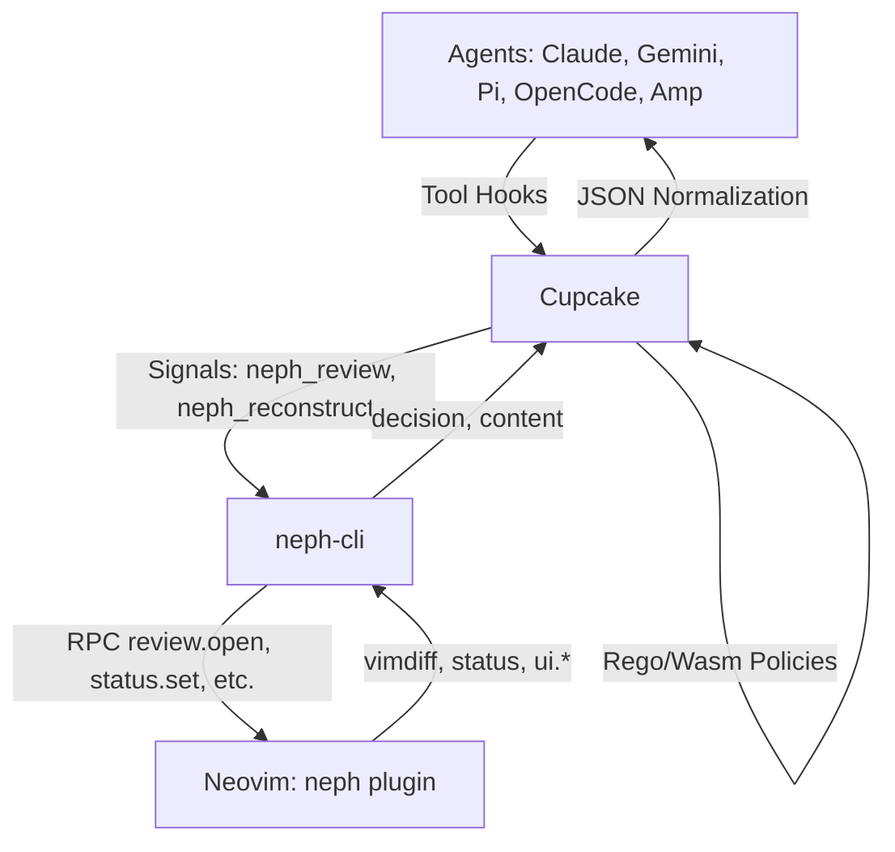

# Neph.nvim Documentation
*Version Date: Sat Mar 28 16:26:00 UTC 2026*

## Overview
Neph.nvim is a Neovim integration layer for AI agents. It provides interactive code review, terminal management, and status bridging between agents and Neovim. The project uses a composable Dependency Injection (DI) architecture and handles agent interactions safely without allowing direct access to Neovim.

## Architecture
Cupcake serves as the sole integration layer. Agents never communicate directly with Neovim; instead, they interface with `cupcake eval`, which processes deterministic policies (< 1ms execution time) to prevent unsafe operations (like `rm -rf` or writes to `.env`). For write or edit tools, Cupcake triggers `neph-cli` as a review signal, bridging to Neovim via an RPC protocol.

### Component Diagram

### Components
1. **Cupcake (Policy + Routing Layer):** Evaluates Rego/Wasm policies. Routes write/edit commands to interactive review using `neph_review` and `neph_reconstruct` signals.
2. **neph-cli (Editor Abstraction):** A Node.js CLI bridging Cupcake signals to Neovim via a socket protocol. It does not have any agent-specific awareness.
3. **RPC Dispatch Facade (`lua/neph/rpc.lua`):** A Lua module handling incoming RPC to API modules.
4. **API Modules (`lua/neph/api/`):** Modules managing review logic, vim variables, and UI states.
5. **Review Engine vs. UI:** The pure logic (headless computation) vs the actual Vimdiff tab with per-hunk reject/accept controls.

## Key Flows

### Interactive Review Flow
1. An agent attempts a file write or edit tool.
2. The agent's hook triggers `cupcake eval --harness <agent>`.
3. Cupcake evaluates its deterministic security policies.
4. If allowed, Cupcake triggers the `neph_review` signal.
5. `neph_reconstruct` normalizes the agent's JSON payload into `{ path, content }`.
6. `neph-cli review` receives the normalized data and connects to Neovim via the `$NVIM_SOCKET_PATH`.
7. Neovim invokes the `review.open` RPC, opening a vimdiff tab.
8. The user reviews changes interactively per hunk.
9. `neph-cli` returns the review outcome (`{ decision, content }`) to Cupcake via stdout.
10. Cupcake's Rego policy emits `allow`, `modify(updated_input)`, or `deny`.
11. Cupcake converts the decision into the format expected by the originating agent.

## API Endpoints (RPC Protocol)

**Protocol Version:** `neph-rpc/v1`

| Method | Parameters | Async | Description |
|---|---|---|---|
| `review.open` | `request_id`, `path`, `content` (Optional: `channel_id`, `result_path`, `agent`, `mode`) | Yes | Opens an interactive vimdiff review session. |
| `status.set` | `name`, `value` | No | Sets a `vim.g` global variable. |
| `status.get` | `name` | No | Retrieves a `vim.g` global variable. |
| `status.unset` | `name` | No | Removes a `vim.g` global variable. |
| `buffers.check` | (none) | No | Triggers `:checktime` in Neovim. |
| `tab.close` | (none) | No | Closes the active tab. |
| `ui.select` | `request_id`, `channel_id`, `title`, `options` | Yes | Opens a UI selection dialog. |
| `ui.input` | `request_id`, `channel_id`, `title`, `default` | Yes | Opens a UI input dialog. |
| `ui.notify` | `message`, `level` | No | Sends a notification to Neovim. |
| `bus.register` | `name`, `channel` | No | *(Internal)* Registers an extension agent's RPC channel. |

## Changelog
- **[Sat Mar 28 16:26:00 UTC 2026]:** Initial creation of unified Markdown documentation file based on project architecture, protocol spec, and recent repository state. Includes integration flow details, component architecture, and the `neph-rpc/v1` specification.
