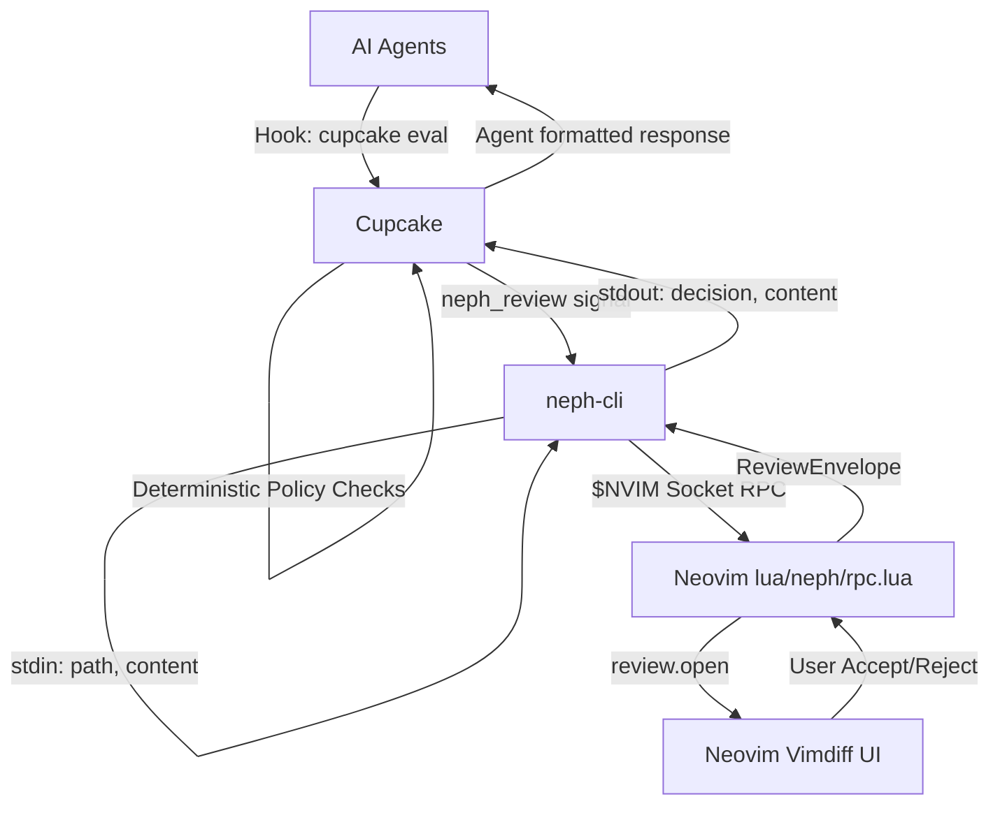
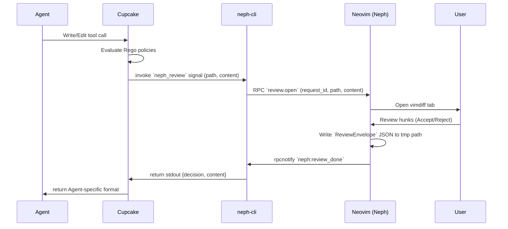

# Project Documentation

## Overview
**neph.nvim** is a Neovim plugin designed as a universal bridge between AI coding agents and Neovim. It facilitates interactive, hunk-by-hunk code diff reviews, manages terminal state, and discovers tool integrations through a custom RPC interface. By operating primarily as a policy and integration layer rather than directly controlling Neovim, it ensures agents remain separated from Neovim APIs, interacting instead through controlled signals and deterministic policies.

## Architecture

Neph.nvim relies on a strict separation of concerns, orchestrated through several sub-components:
*   **Cupcake (Policy & Integration Layer):** The primary endpoint for all agents. Evaluates fast, deterministic Rego/Wasm policies to block dangerous actions and protect sensitive files. It issues signals to `neph-cli` for review.
*   **neph-cli (Editor Abstraction):** A Node.js CLI bridging Cupcake signals to Neovim over an RPC socket (`NVIM_SOCKET_PATH`). It is editor-agnostic in its agent-facing interactions.
*   **Lua Plugin (`lua/neph/`):** Core Neovim integration, structured with a Dependency Injection (DI) pattern for agents and terminal backends (e.g., snacks, wezterm, zellij).
*   **RPC Protocol (`neph-rpc/v1`):** A rigid msgpack-rpc contract connecting the CLI with the Neovim instance.

## Key Flows

### Interactive Diff Review
This flow executes when an agent attempts to write or edit a file:

## API Endpoints

The project uses a custom RPC protocol (`neph-rpc/v1`) to bridge external CLI tools with Neovim. The interface is defined in `protocol.json`.

| Method | Params | Async | Description |
| :--- | :--- | :--- | :--- |
| `review.open` | `request_id`, `result_path`, `channel_id`, `path`, `content` | Yes | Opens an interactive vimdiff review. Returns a `ReviewEnvelope` containing hunk-by-hunk decisions. |
| `status.set` | `name`, `value` | No | Sets a `vim.g` global variable for status tracking. |
| `status.get` | `name` | No | Gets a `vim.g` global variable. |
| `status.unset` | `name` | No | Unsets a `vim.g` global variable. |
| `buffers.check` | (none) | No | Triggers `:checktime` in Neovim to reload externally modified buffers. |
| `tab.close` | (none) | No | Closes the active tab in Neovim. |

*Note: Extensions might additionally utilize a `bus.register(name, channel)` method internally to connect extension agent msgpack-rpc channels, though this is excluded from the canonical `protocol.json`.*

## Changelog

*   [2026-04-05 16:26:08Z]: Initial creation of unified documentation file consolidating Architecture, Protocol, and Overview.
