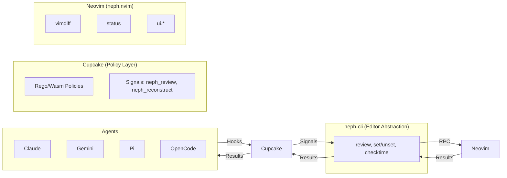
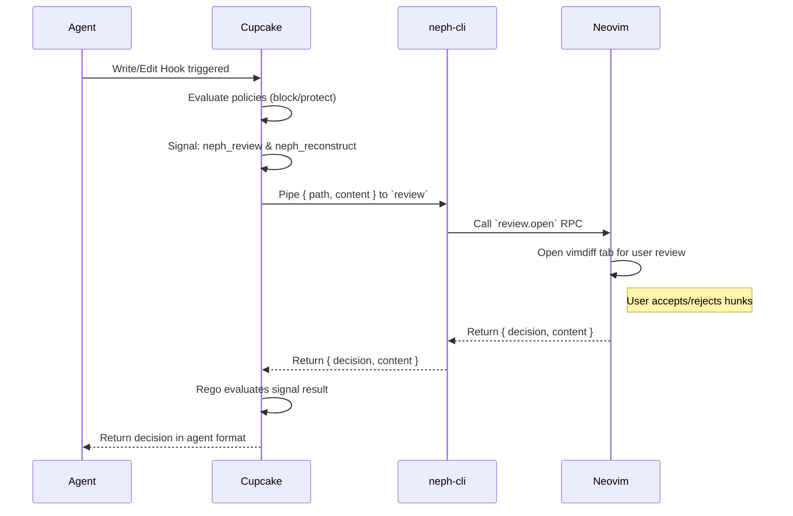

# Neph Documentation

## Overview

Neph.nvim is a Neovim integration layer for AI agents. It provides interactive code review, terminal management, and status bridging between agents and Neovim. The core principle is that **Cupcake is the sole integration layer**—agents never communicate with Neovim directly. Instead, agent hooks trigger `cupcake eval`, which evaluates deterministic policies and invokes `neph-cli` as a signal for interactive review.

## Architecture

Neph.nvim employs a Composable Dependency Injection (DI) architecture.

### Component Boundaries

1.  **Cupcake (Policy + Routing Layer):** Evaluates deterministic policies (`review.rego`, `dangerous_commands.rego`, `protected_paths.rego`) and invokes `neph_review` signals for write/edit tools. Handles agent-specific JSON formatting.
2.  **neph-cli (Editor Abstraction):** A Node.js CLI bridging Cupcake to Neovim. Communicates via stdin/stdout (`{path, content}` to `{decision, content, reason}`) and has zero agent awareness.
3.  **RPC Dispatch Facade (`lua/neph/rpc.lua`):** Routes incoming RPC over Unix sockets (`$NVIM`) to internal API modules.
4.  **API Modules (`lua/neph/api/`):** Stateless modules for `review`, `status`, `buffers`, and `ui`.
5.  **Review Engine vs. UI:** The review system separates pure logic (`engine.lua`) from the UI (`ui.lua` - vimdiff tab).
6.  **Cupcake Signals:** `neph_review` pipes agent output to `neph_reconstruct` and then to `neph-cli review`.

## Key Flows

### Interactive Review Data Flow

## API Endpoints (RPC Protocol)

The protocol version is `neph-rpc/v1`. Neovim RPC uses msgpack-rpc over Unix sockets (`$NVIM`).

| Method | Params | Async? | Description |
| :--- | :--- | :--- | :--- |
| `review.open` | `request_id`, `result_path`, `channel_id`, `path`, `content` | Yes | Opens an interactive vimdiff review. |
| `status.set` | `name`, `value` | No | Sets a `vim.g` global variable. |
| `status.get` | `name` | No | Gets a `vim.g` global variable. |
| `status.unset` | `name` | No | Unsets a `vim.g` global variable. |
| `buffers.check` | (none) | No | Calls `:checktime` in Neovim. |
| `tab.close` | (none) | No | Closes the current tab. |

*Internal Method:* `bus.register(name, channel)` registers an extension agent's msgpack-rpc channel.

## Testing Strategy

Neph.nvim uses a multi-layered testing strategy:
1.  **Lua Unit Tests:** Run using `plenary.busted` headlessly (`task test`).
2.  **CLI Unit Tests:** Node/Vitest tests in `tools/neph-cli/tests/` (`task tools:test:neph`).
3.  **Shared Library Tests:** Node/Vitest in `tools/lib/tests/`.
4.  **Pi Extension Tests:** Node/Vitest verifying Cupcake harness (`task tools:test:pi`).
5.  **Contract Tests:** Ensure Lua RPC dispatch and TS CLI sync with `protocol.json`.
6.  **E2E Tests:** Headless smoke tests (`task test:e2e`).
7.  **Manual UI Verification:** Used for Vimdiff, signs, and virtual text.
8.  **Continuous Integration:** Executed via Dagger pipeline (`task ci`).

## Changelog

*   **[2026-04-06 16:17:59 UTC]:** Initial consolidation of documentation into a single markdown file (`docs.md`), utilizing Mermaid diagrams for architecture and interactive review flows.
