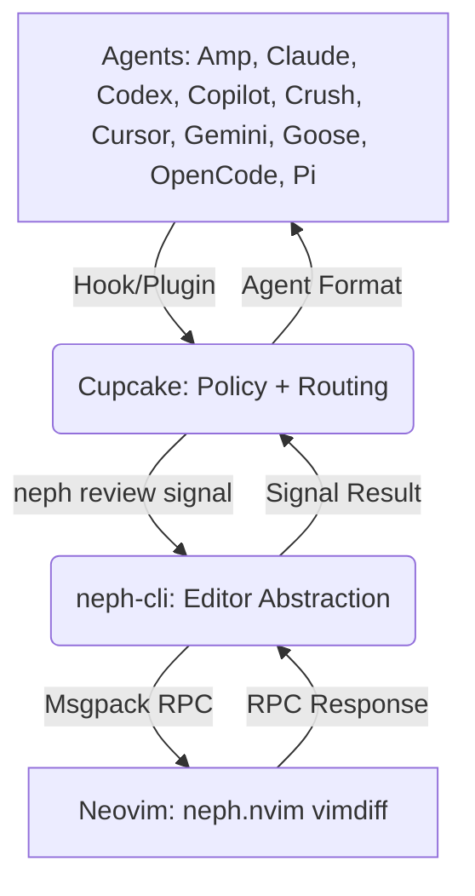
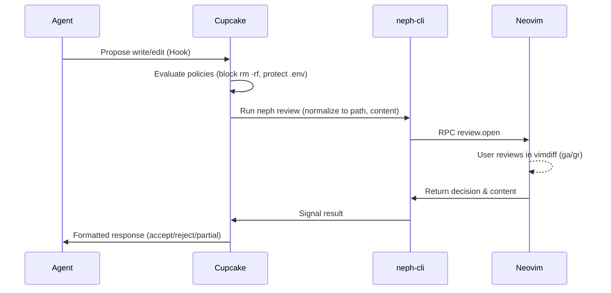

# Project Documentation

## Overview
Neph.nvim is a Neovim plugin for interactive code review using LLMs. It acts as an integration layer, providing terminal management, status bridging, and interactive diff reviews. It ensures agents do not interact with Neovim directly by using an intermediate policy and routing layer.

## Architecture

The system enforces a strict boundary where agents interact with the Cupcake policy layer, which invokes a CLI bridge to signal Neovim.

## Key Flows

### Interactive Review Flow

This flow triggers when an agent proposes file modifications.

## API Endpoints

The project uses a custom RPC protocol (`neph-rpc/v1`) between the `neph-cli` and Neovim over Unix sockets (`NVIM_SOCKET_PATH`).

| Method | Description |
|--------|-------------|
| `review.open` | Params: `[request_id, path, content]`. Opens an interactive vimdiff review. Returns `{ decision, content, hunks, reason }`. |
| `status.set` | Params: `[name, value]`. Sets a `vim.g` global variable. |
| `status.get` | Params: `[name]`. Gets a `vim.g` global variable. |
| `status.unset` | Params: `[name]`. Unsets a `vim.g` global variable. |
| `buffers.check` | Params: `[]`. Calls `:checktime` to sync files. |
| `tab.close` | Params: `[]`. Closes the current tab. |
| `ui.select` | Params: `[request_id, channel_id, title, options]`. |
| `ui.input` | Params: `[request_id, channel_id, title, default]`. |
| `ui.notify` | Params: `[message, level]`. |
| `tools.status` | Params: `[]`. |
| `tools.install` | Params: `[name]`. |
| `tools.install_all` | Params: `[]`. |
| `tools.uninstall` | Params: `[name]`. |
| `tools.preview` | Params: `[]`. |
| `review.status` | Params: `[]`. |
| `review.accept` | Params: `[]`. |
| `review.reject` | Params: `[]`. |
| `review.accept_all` | Params: `[]`. |
| `review.reject_all` | Params: `[]`. |
| `review.submit` | Params: `[]`. |
| `review.next` | Params: `[]`. |

## Changelog
* [2026-04-07 16:07:50]: Initial documentation created aggregating Architecture, Flows, and RPC API.
* [2026-05-15 16:22:48]: Updated Architecture, Flows, and API Endpoints to match latest codebase.
