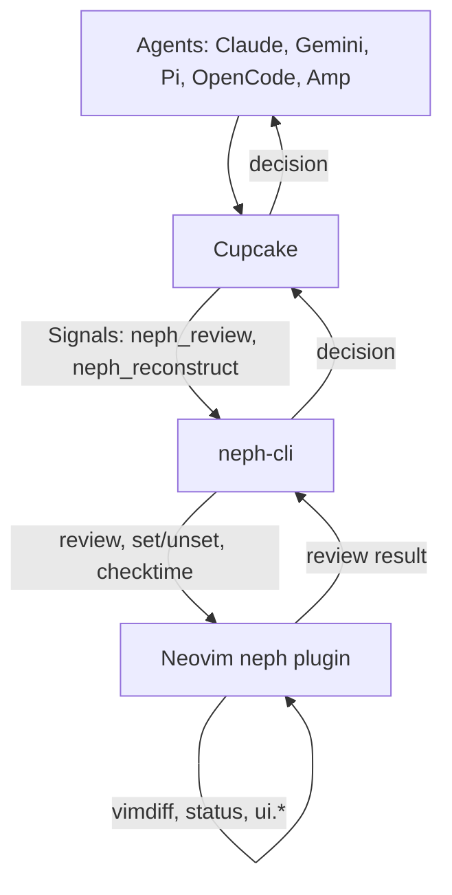
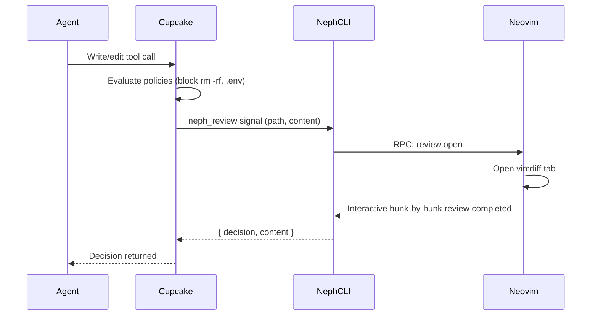

# Neph Documentation

## Overview
Neph.nvim is a Neovim integration layer for AI coding agents. It provides a universal bridge between agents and Neovim, enabling interactive code reviews, terminal management, and state bridging through a custom RPC interface without agents talking directly to Neovim.

## Architecture

Cupcake is the sole integration layer. Agents communicate with Cupcake, which evaluates deterministic policies, and invokes `neph-cli` as a signal for interactive review if required. `neph-cli` connects to Neovim.

## Key Flows

### Interactive Review Flow

## API Endpoints

The system uses a custom RPC protocol (`neph-rpc/v1`) via Unix sockets to bridge `neph-cli` and Neovim.

| Endpoint | Parameters | Async | Description |
|---|---|---|---|
| `review.open` | `request_id`, `result_path`, `channel_id`, `path`, `content` | Yes | Opens an interactive vimdiff review. |
| `status.set` | `name`, `value` | No | Sets a `vim.g` global variable. |
| `status.get` | `name` | No | Gets a `vim.g` global variable. |
| `status.unset` | `name` | No | Unsets a `vim.g` global variable. |
| `buffers.check` | none | No | Calls `:checktime` in Neovim. |
| `tab.close` | none | No | Closes the current tab. |

## Changelog
- **[2026-03-27 09:01:09]**: Initial documentation consolidation.
