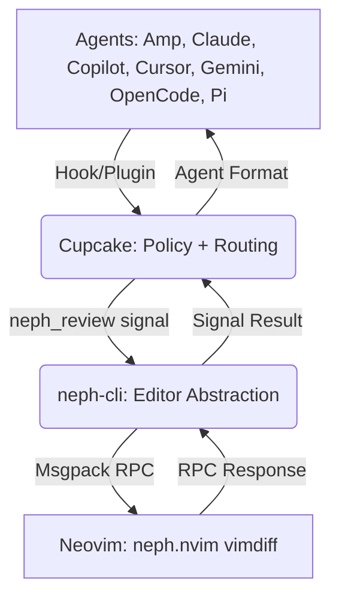
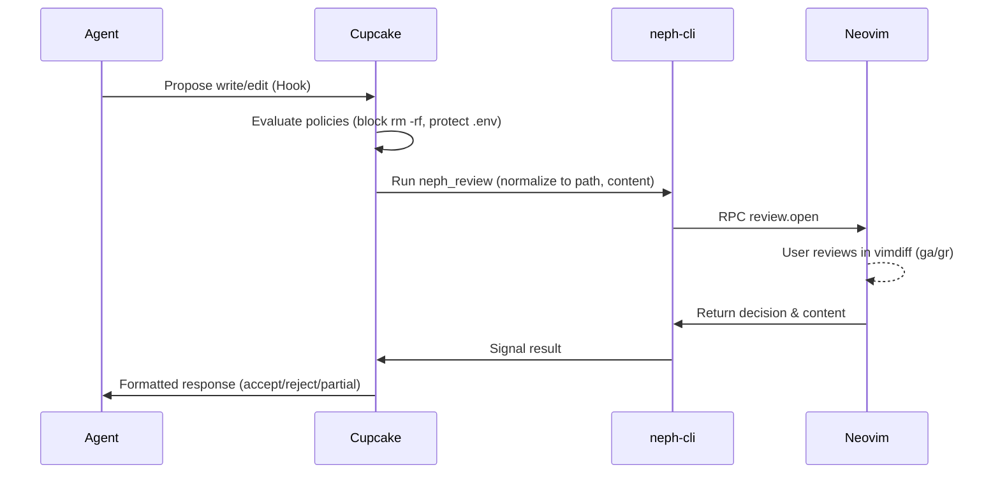

# Project Documentation

## Overview
Neph.nvim is a Neovim plugin for interactive code review using LLMs. It acts as an integration layer, providing terminal management, status bridging, and interactive diff reviews. It ensures agents do not interact with Neovim directly by using an intermediate policy and routing layer.

## Architecture

The system enforces a strict boundary where agents interact with the Cupcake policy layer, which invokes a CLI bridge to signal Neovim.

## Key Flows

### Interactive Review Flow

This flow triggers when an agent proposes file modifications.

## API Endpoints

The project uses a custom RPC protocol (`neph-rpc/v1`) between the `neph-cli` and Neovim over Unix sockets (`$NVIM`).

| Method | Description |
|--------|-------------|
| `review.open` | Opens an interactive vimdiff review. Returns `{ decision, content, hunks, reason }`. |
| `status.set` | Sets a `vim.g` global variable. |
| `status.get` | Gets a `vim.g` global variable. |
| `status.unset` | Unsets a `vim.g` global variable. |
| `buffers.check` | Calls `:checktime` to sync files. |
| `tab.close` | Closes the current tab. |
| `ui.select` | Shows a UI select prompt to the user. |
| `ui.input` | Shows a UI input prompt to the user. |
| `ui.notify` | Shows a UI notification to the user. |
| `tools.status` | Retrieves status of installed tools. |
| `tools.install` | Installs a specific tool. |
| `tools.install_all` | Installs all tools. |
| `tools.uninstall` | Uninstalls a specific tool. |
| `tools.preview` | Previews tool installations. |
| `review.status` | Retrieves the status of the current review. |
| `review.accept` | Accepts a specific review hunk or file. |
| `review.reject` | Rejects a specific review hunk or file. |
| `review.accept_all` | Accepts all review hunks or files. |
| `review.reject_all` | Rejects all review hunks or files. |
| `review.submit` | Submits the current review. |
| `review.next` | Moves to the next review item. |

## Changelog
* [2026-04-07 16:07:50]: Initial documentation created aggregating Architecture, Flows, and RPC API.
* [2026-04-16 16:38:57]: Updated Architecture diagram to include Amp, Copilot, and Cursor. Updated API Endpoints to align with `protocol.json`.
