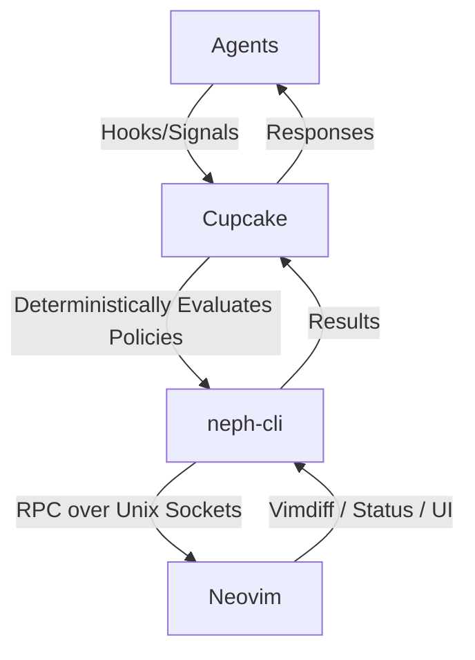

# Project Documentation

## Overview
**neph.nvim** is a Neovim plugin that acts as a universal bridge between AI coding agents and Neovim. It facilitates interactive diff reviews, terminal management, and tool discovery without allowing agents to communicate directly with Neovim.

## Architecture

### Components
1. **Cupcake**: The sole policy and routing layer. It intercepts agent actions and evaluates deterministic Rego/Wasm policies.
2. **neph-cli**: A Node.js CLI that links Cupcake signals to Neovim over an RPC interface (`$NVIM` socket).
3. **Neovim Lua Plugin**: Implements the RPC dispatch, diff review logic (engine & UI), and terminal backends.

## Key Flows

### Interactive Review Flow
1. An agent proposes a file write/edit tool call.
2. Cupcake evaluates policies. If valid, it fires the `neph_review` signal.
3. The signal normalizes the tool JSON into `{ path, content }` via `neph_reconstruct`.
4. `neph-cli review` sends this to Neovim.
5. Neovim opens a vimdiff tab with the current and proposed text.
6. The user accepts/rejects hunks interactively.
7. `neph-cli` retrieves the `{ decision, content }` and returns it.
8. Cupcake propagates the response to the agent.

## API Endpoints

The system exposes the following core RPC methods (protocol version `neph-rpc/v1`):

| Method | Async? | Description |
|--------|--------|-------------|
| `review.open` | Yes | Opens an interactive vimdiff review. |
| `status.set` | No | Sets a `vim.g` global variable. |
| `status.get` | No | Gets a `vim.g` global variable. |
| `status.unset` | No | Unsets a `vim.g` global variable. |
| `buffers.check`| No | Calls `:checktime` to reload buffers. |
| `tab.close` | No | Closes the current tab. |

## Changelog
* **[2026-03-08 12:00:00 UTC]**: Initial generation of unified documentation from architecture, testing, and RPC specifications.
