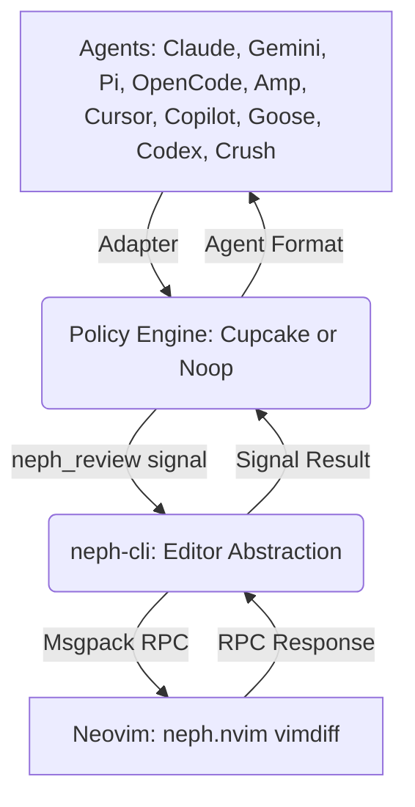
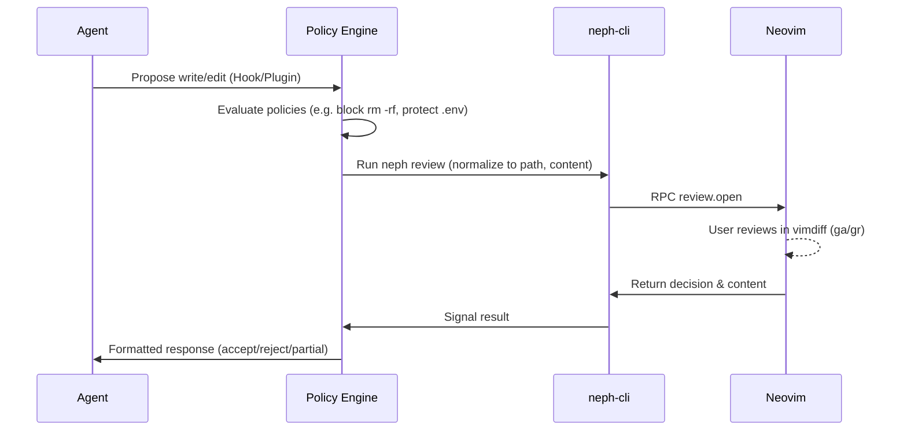

# Project Documentation

## Overview
Neph.nvim is a Neovim plugin for interactive code review using LLMs. It acts as an integration layer, providing terminal management, status bridging, and interactive diff reviews. Integrations flow through a composable pipeline (Agent event → Adapter → Policy engine → Review provider → Response formatter) to ensure agents do not interact with Neovim directly.

## Architecture

The system enforces a strict boundary where agents interact with a policy layer (either `cupcake` or `noop`), which invokes a CLI bridge to signal Neovim.

## Key Flows

### Interactive Review Flow

This flow triggers when an agent proposes file modifications.

## API Endpoints

The project uses a custom RPC protocol (`neph-rpc/v1`) between the `neph-cli` and Neovim over Unix sockets (`$NVIM`).

| Method | Description |
|--------|-------------|
| `review.open` | Opens an interactive vimdiff review. Returns `{ decision, content, hunks, reason }`. |
| `status.set` | Sets a `vim.g` global variable. |
| `status.unset` | Unsets a `vim.g` global variable. |
| `status.get` | Gets a `vim.g` global variable. |
| `buffers.check` | Calls `:checktime` to sync files. |
| `tab.close` | Closes the current tab. |
| `ui.select` | Shows a UI selection prompt. |
| `ui.input` | Shows a UI text input prompt. |
| `ui.notify` | Displays a notification. |
| `tools.status` | Gets the status of installed tools. |
| `tools.install` | Installs a specific tool. |
| `tools.install_all` | Installs all tools. |
| `tools.uninstall` | Uninstalls a specific tool. |
| `tools.preview` | Previews tools. |
| `review.status` | Gets the status of the current review. |
| `review.accept` | Accepts the current review or a specific hunk. |
| `review.reject` | Rejects the current review or a specific hunk. |
| `review.accept_all` | Accepts all review hunks. |
| `review.reject_all` | Rejects all review hunks. |
| `review.submit` | Submits the completed review. |
| `review.next` | Moves to the next review item. |

## Changelog
* [2026-04-07 16:07:50]: Initial documentation created aggregating Architecture, Flows, and RPC API.
* [2026-04-22 16:46:48]: Updated Overview and Architecture to describe composable pipeline. Updated Mermaid diagrams to include Policy Engine. Updated API Endpoints with new methods from `protocol.json` (added `ui.*`, `tools.*`, `review.*` and removed `bus.register`).
