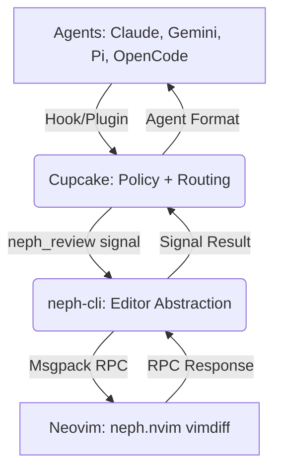
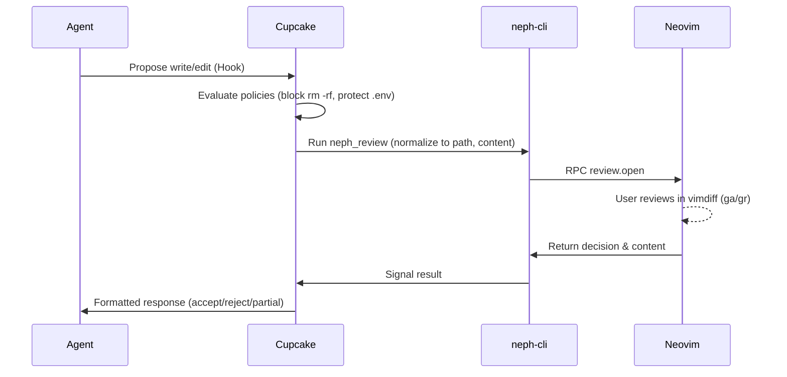

# Project Documentation

## Overview
Neph.nvim is a Neovim plugin for interactive code review using LLMs. It acts as an integration layer, providing terminal management, status bridging, and interactive diff reviews. It ensures agents do not interact with Neovim directly by using an intermediate policy and routing layer.

## Architecture

The system enforces a strict boundary where agents interact with the Cupcake policy layer, which invokes a CLI bridge to signal Neovim.

```mermaid
graph TD
    A[Agents: Claude, Gemini, Pi, OpenCode] -->|Hook/Plugin| B(Cupcake: Policy + Routing)
    B -->|neph_review signal| C(neph-cli: Editor Abstraction)
    C -->|Msgpack RPC| D[Neovim: neph.nvim vimdiff]
    D -->|RPC Response| C
    C -->|Signal Result| B
    B -->|Agent Format| A
```

## Key Flows

### Interactive Review Flow

This flow triggers when an agent proposes file modifications.

```mermaid
sequenceDiagram
    participant A as Agent
    participant C as Cupcake
    participant NCLI as neph-cli
    participant NV as Neovim

    A->>C: Propose write/edit (Hook)
    C->>C: Evaluate policies (block rm -rf, protect .env)
    C->>NCLI: Run neph_review (normalize to path, content)
    NCLI->>NV: RPC review.open
    NV-->>NV: User reviews in vimdiff (ga/gr)
    NV->>NCLI: Return decision & content
    NCLI->>C: Signal result
    C->>A: Formatted response (accept/reject/partial)
```

## API Endpoints

The project uses a custom RPC protocol (`neph-rpc/v1`) between the `neph-cli` and Neovim over Unix sockets (`$NVIM`).

| Method | Description |
|--------|-------------|
| `review.open` | Opens an interactive vimdiff review. `params=["request_id", "path", "content"]`, `optional=["channel_id", "result_path", "agent", "mode"]`, `async=true` |
| `status.set` | Sets a `vim.g` global variable. `params=["name", "value"]`, `async=false` |
| `status.get` | Gets a `vim.g` global variable. `params=["name"]`, `async=false` |
| `status.unset` | Unsets a `vim.g` global variable. `params=["name"]`, `async=false` |
| `buffers.check` | Calls `:checktime` to sync files. `params=[]`, `async=false` |
| `tab.close` | Closes the current tab. `params=[]`, `async=false` |
| `ui.select` | UI interaction to select an option. `params=["request_id", "channel_id", "title", "options"]`, `async=true` |
| `ui.input` | UI interaction to get user input. `params=["request_id", "channel_id", "title", "default"]`, `async=true` |
| `ui.notify` | UI interaction to show a notification. `params=["message", "level"]`, `async=false` |
| `tools.status` | Get tools status. `params=[]`, `async=false` |
| `tools.install` | Install a tool. `params=["name"]`, `async=false` |
| `tools.install_all` | Install all tools. `params=[]`, `async=false` |
| `tools.uninstall` | Uninstall a tool. `params=["name"]`, `async=false` |
| `tools.preview` | Preview tools. `params=[]`, `async=false` |
| `review.status` | Get review status. `params=[]`, `async=false` |
| `review.accept` | Accept a review hunk. `params=[]`, `optional=["idx"]`, `async=false` |
| `review.reject` | Reject a review hunk. `params=[]`, `optional=["idx", "reason"]`, `async=false` |
| `review.accept_all` | Accept all review hunks. `params=[]`, `async=false` |
| `review.reject_all` | Reject all review hunks. `params=[]`, `optional=["reason"]`, `async=false` |
| `review.submit` | Submit the review. `params=[]`, `async=false` |
| `review.next` | Go to the next review hunk. `params=[]`, `async=false` |

## Changelog
* [2026-06-07 16:33:08]: Updated API Endpoints to sync with protocol.json.
* [2026-04-07 16:07:50]: Initial documentation created aggregating Architecture, Flows, and RPC API.
